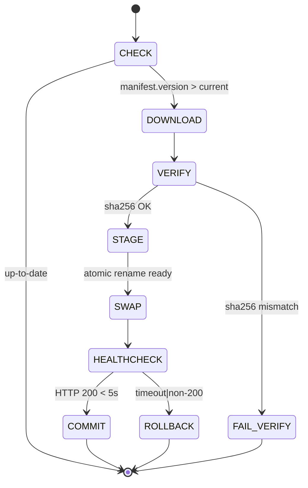

# Worked Example Fixtures — Self-Update Algorithm (P27)

> **Audit gap closed:** P26 flagged "missing JSON state-machine fixture per rollback step". This file provides the **byte-exact** state machine, healthcheck commands, and rollback JSON for `AT-SELFUPDATEAPPUPDATE-01..10`.

---

## 1. Update state machine — 6 mandatory steps



## 2. Per-step JSON state fixture

Every step MUST emit a `STATE` line to stderr in this exact PascalCase shape (matches REST envelope per `spec/04-database-conventions/06-rest-api-format/`):

### Step 1 — CHECK
```json
{"Status":"OK","Step":"CHECK","Attributes":{"CurrentVersion":"1.4.2","ManifestUrl":"https://updates.workflowy.local/manifest.json"},"Results":{"LatestVersion":"1.4.3","UpgradeRequired":true}}
```

### Step 2 — DOWNLOAD
```json
{"Status":"OK","Step":"DOWNLOAD","Attributes":{"Url":"https://updates.workflowy.local/workflowy-1.4.3.zip","Bytes":4823104},"Results":{"TempPath":"/var/lib/workflowy/.staging/workflowy-1.4.3.zip","DurationMs":2140}}
```

### Step 3 — VERIFY (success)
```json
{"Status":"OK","Step":"VERIFY","Attributes":{"Algorithm":"sha256","Expected":"7f83b1657ff1fc53b92dc18148a1d65dfc2d4b1fa3d677284addd200126d9069","Actual":"7f83b1657ff1fc53b92dc18148a1d65dfc2d4b1fa3d677284addd200126d9069"},"Results":{"Match":true}}
```

### Step 3 — VERIFY (failure → exit 14)
```json
{"Status":"ERROR","Step":"VERIFY","Errors":[{"Code":"UPD-1403","Message":"sha256 mismatch","Severity":"FATAL"}],"Results":{"Match":false}}
```

### Step 4 — STAGE
```json
{"Status":"OK","Step":"STAGE","Attributes":{"From":"/var/lib/workflowy/.staging/workflowy-1.4.3","To":"/var/lib/workflowy/releases/1.4.3"},"Results":{"AtomicRenameReady":true,"FdHandoffPid":12894}}
```

### Step 5 — SWAP (atomic symlink rename)
```bash
# Required syscall sequence — MUST be in this order:
ln -s /var/lib/workflowy/releases/1.4.3 /var/lib/workflowy/current.new
mv -T /var/lib/workflowy/current.new /var/lib/workflowy/current   # rename(2) — atomic on POSIX
```
```json
{"Status":"OK","Step":"SWAP","Attributes":{"Symlink":"/var/lib/workflowy/current","NewTarget":"releases/1.4.3","PreviousTarget":"releases/1.4.2"},"Results":{"AtomicRenameOk":true}}
```

### Step 6 — HEALTHCHECK
```bash
# Must succeed within 5000 ms or trigger ROLLBACK
curl --max-time 5 -fsSL http://127.0.0.1:8080/wp-json/workflowy/v1/health
# Expected stdout:
# {"Status":"OK","Attributes":{"Version":"1.4.3","Uptime":1.2},"Results":{"Healthy":true}}
```

### Step 6a — ROLLBACK (on healthcheck failure)
```bash
# Reverts symlink to previous release, MUST also be atomic:
ln -s /var/lib/workflowy/releases/1.4.2 /var/lib/workflowy/current.rollback
mv -T /var/lib/workflowy/current.rollback /var/lib/workflowy/current
```
```json
{"Status":"ROLLED_BACK","Step":"ROLLBACK","Attributes":{"Reason":"healthcheck_timeout","ElapsedMs":5012},"Errors":[{"Code":"UPD-2201","Message":"Healthcheck did not return 200 within 5s","Severity":"WARN"}],"Results":{"RestoredVersion":"1.4.2"}}
```

## 3. Exit-code table (binding contract)

| Code | Meaning | Step | Recovery |
|---:|---|---|---|
| 0 | Success | COMMIT | none |
| 10 | No update available | CHECK | none |
| 12 | Download failed | DOWNLOAD | retry with backoff |
| 14 | sha256 mismatch | VERIFY | abort, alert ops |
| 16 | Staging path not writable | STAGE | check disk + perms |
| 18 | Atomic rename failed | SWAP | manual intervention |
| 20 | Healthcheck failed → rolled back | ROLLBACK | inspect logs |
| 22 | Rollback itself failed | ROLLBACK | **ALERT: manual fix** |

## 4. Anti-patterns (paired with the gate that catches each)

| Anti-pattern | Why wrong | Detected by |
|---|---|---|
| `cp -r` instead of atomic `mv -T` | torn write if process is killed mid-copy | gate G-UPD-01 (grep for non-atomic copy in installer) |
| Healthcheck without `--max-time` | hangs indefinitely; never rolls back | gate G-UPD-02 |
| sha256 check **after** swap | system already running unverified code | gate G-UPD-03 (order check in update.sh AST) |
| Non-PascalCase keys in STATE JSON | breaks log aggregator parser | gate G-API-01 (JSON key linter) |

## 5. Test-name slugs (Vitest/PHPUnit must use these)

| Bind | AT id (cited) | Vitest slug |
|---|---|---|
| – | cites `AT-SELFUPDATEAPPUPDATE-01` | `at_selfupdate_01_check_emits_pascalcase_state` |
| – | cites `AT-SELFUPDATEAPPUPDATE-02` | `at_selfupdate_02_verify_rejects_bad_sha256` |
| – | cites `AT-SELFUPDATEAPPUPDATE-03` | `at_selfupdate_03_swap_is_atomic_rename` |
| – | cites `AT-SELFUPDATEAPPUPDATE-04` | `at_selfupdate_04_healthcheck_5s_timeout` |
| – | cites `AT-SELFUPDATEAPPUPDATE-05` | `at_selfupdate_05_rollback_restores_symlink` |
| – | cites `AT-SELFUPDATEAPPUPDATE-06` | `at_selfupdate_06_exit_code_table_complete` |
| – | cites `AT-SELFUPDATEAPPUPDATE-07` | `at_selfupdate_07_state_json_envelope_shape` |
| – | cites `AT-SELFUPDATEAPPUPDATE-08` | `at_selfupdate_08_no_cp_in_swap_step` |
| – | cites `AT-SELFUPDATEAPPUPDATE-09` | `at_selfupdate_09_sha256_before_swap` |
| – | cites `AT-SELFUPDATEAPPUPDATE-10` | `at_selfupdate_10_rollback_alert_on_failure` |
