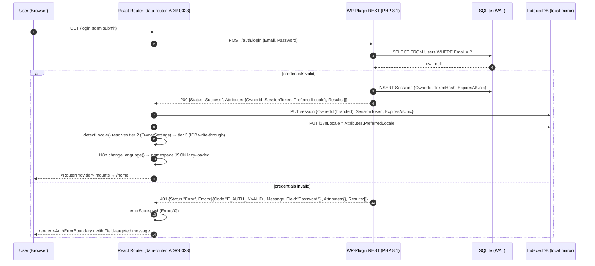

# Sequence Diagrams — Canonical Flows

**Status:** NORMATIVE. These Mermaid diagrams are the authoritative visual SSOT for the four most cross-referenced runtime flows. ADRs cited per-step are the textual SSOT; if a diagram and an ADR disagree, **the ADR wins** and this file MUST be patched in the same PR (gate `G-DOC-01-DIAGRAM-ADR-PARITY`).

**Scope:** 4 flows — auth handshake, mutation→queue→sync, SSE cold-gap recovery, locale boot order. Other flows (drag-and-drop, multi-select, search) remain prose-only until promoted by user demand.

---

## 1. Auth Handshake

**ADRs:** ADR-0004 (REST envelope), ADR-0019 (PascalCase), ADR-0020 (branded `OwnerId`), ADR-0023 (loader↔queue boot ordering).



**Invariants asserted:**
- API response MUST conform to envelope (PascalCase, all 5 mandatory fields present per ADR-0004 §3).
- `OwnerId` MUST be branded at the parser site (`envelope.types.ts` per GAP-CON-02) — raw string forbidden (ADR-0020).
- Locale persistence MUST go to IndexedDB, NOT localStorage (ADR-0021); confirmed by `G-28-DETECTION-ORDER` AT scenario #5.
- Error path MUST NOT bubble to `AppErrorBoundary` — auth errors land in named `AuthErrorBoundary` per ADR-0017.

---

## 2. Mutation → Queue → Sync (Loader↔Queue Contract)

**ADRs:** ADR-0023 (loader↔queue contract), ADR-0021 (undo cap 100, queue unbounded), ADR-0024 (LWW tiebreak), ADR-0025 (SSE read-signal only).

```mermaid
sequenceDiagram
    autonumber
    participant U as User
    participant C as Component (e.g., EditorBoundary scope)
    participant L as Loader (route-level)
    participant IDB as IndexedDB (mirror + queue)
    participant QW as Queue Worker (singleton)
    participant API as WP-Plugin REST
    participant SSE as SSE Stream (/stream/page/{id})

    Note over L,IDB: Read path (≤16 ms p95, ADR-0023)
    U->>C: Navigate to /item/abc123
    C->>L: route loader(args)
    L->>IDB: SELECT FROM mirror WHERE PageId = abc123
    IDB-->>L: rows (always returned, never fetched here)
    L-->>C: defer({nodes}) — render immediately

    Note over U,QW: Write path (single IDB tx, queue is sole egress)
    U->>C: Edit node content
    C->>IDB: tx{ UPDATE mirror SET Content; INSERT queue {ClientMutationId, Op, Payload} }
    IDB-->>C: tx commit OK → optimistic UI confirmed
    C->>C: undoStack.push(inverseOp)  // cap 100 in-memory (ADR-0021)

    QW->>IDB: SELECT FROM queue ORDER BY EnqueuedAtUnix LIMIT 1
    IDB-->>QW: mutation row
    QW->>API: POST /items/{id} {Op, Payload, ClientMutationId}
    alt 2xx success
        API-->>QW: 200 {Status:"Success", Attributes:{ServerSeq, UpdatedAtUnix}}
        QW->>IDB: DELETE FROM queue WHERE ClientMutationId = ?
        QW->>IDB: UPDATE mirror SET ServerSeq, UpdatedAtUnix (LWW tiebreak ADR-0024)
    else 409 conflict
        API-->>QW: 409 {Status:"Error", Errors:[{Code:"E_LWW_LOSER"}], Attributes:{WinningRow}}
        QW->>IDB: UPDATE mirror SET <- WinningRow (server wins)
        QW->>IDB: DELETE FROM queue WHERE ClientMutationId = ?
        QW->>C: errorStore.push(soft-warning, recoverable)
    else network error
        QW->>QW: backoff (exp, max 30 s); leave row in queue (UNBOUNDED, ADR-0021)
    end

    Note over SSE,IDB: SSE is read-signal ONLY (never enqueues)
    SSE-->>L: event: item.updated {Event, ItemId, ServerSeq, ...}
    L->>IDB: UPDATE mirror (apply patch); router revalidates affected loaders
```

**Invariants asserted:**
- Loaders MUST NOT fetch from network (ADR-0023 §D2); test fixture `G-23-LOADER-NO-FETCH` enforces.
- Mirror write + queue insert MUST be in **one IDB transaction** — partial commit forbidden.
- Queue worker is the **sole egress** to network (ADR-0023 §D4); no component may call `fetch`/`axios` outside the worker.
- SSE frames MUST NOT enqueue to FIFO — they are read-signals that drive loader revalidation only (ADR-0025 §D3).
- `ClientMutationId` MUST be branded (per `envelope.types.ts` GAP-CON-02); raw UUID strings forbidden.

---

## 3. SSE Cold-Gap Recovery

**ADRs:** ADR-0025 (SSE transport), ADR-0027 (multi-worker shared ring buffer §D5/D6), GAP-CON-03 (frame schema).

```mermaid
sequenceDiagram
    autonumber
    participant C as Client (EventSource)
    participant N as Nginx / FPM front
    participant W as PHP-FPM Worker (any of N)
    participant Ring as SseRing (SQLite WAL)
    participant Reaper as TTL Reaper (cron)

    Note over Ring,Reaper: Background — every 60 s
    Reaper->>Ring: DELETE WHERE CreatedAtUnix < (now - 300)
    Ring-->>Reaper: rows purged

    Note over C,W: Connect with stale Last-Event-ID
    C->>N: GET /stream/page/{id}\nLast-Event-ID: 1
    N->>W: hand off (long-lived)
    W->>Ring: SELECT MIN(ServerSeq) FROM SseRing WHERE PageId = ?
    Ring-->>W: oldestSeq = 5000
    alt Last-Event-ID < oldestSeq (cold gap)
        W-->>C: event: resync\ndata: {"Event":"resync","Reason":"cold_gap","ServerSeqFloor":5000}
        W-->>C: <connection close>
        C->>C: full mirror reload via REST GET /pages/{id}
        C->>N: GET /stream/page/{id} (no Last-Event-ID — fresh)
    else Last-Event-ID >= oldestSeq (warm replay)
        W->>Ring: SELECT WHERE ServerSeq > Last-Event-ID ORDER BY ServerSeq
        Ring-->>W: backlog rows
        loop for each row
            W-->>C: event: <Event>\nid: <ServerSeq>\ndata: <FrameJSON>
        end
        Note over W,C: connection stays open; live writes continue to be tailed
    end
```

**Invariants asserted:**
- Cold-gap response MUST be exactly **one** `event: resync` frame followed by close (`G-27-COLD-GAP-RESYNC` AT, ADR-0027 §D6).
- Status MUST be `200 OK` (cold-gap is normal recovery, not an error).
- Frame body MUST validate against `spec/00-adrs/sse-frame.schema.json` (`resync` variant) — gate `G-CON-03-SSE-FRAME-SCHEMA`.
- `event:` wire line MUST equal body `Event` field (gate `G-CON-03-SSE-EVENT-LINE-PARITY`).
- TTL = exactly 300 s (`G-27-RING-TTL-300S` AT); reaper interval = 60 s.
- WebSocket / long-poll / 3rd-party push forbidden (ADR-0025 §D1).

---

## 4. Locale Boot Order

**ADRs:** ADR-0028 (i18n locale strategy §D3 detection chain, §D6 RTL), ADR-0021 (no localStorage), ADR-0023 (boot ordering vs router).

```mermaid
sequenceDiagram
    autonumber
    participant App as App entrypoint (main.tsx)
    participant Det as detectLocale()
    participant URL as URL ?locale=
    participant Sess as Session (auth check)
    participant API as REST /me
    participant IDB as IndexedDB i18nLocale
    participant Nav as navigator.language(s)
    participant i18n as i18next runtime
    participant DOM as document.documentElement
    participant Router as React Router

    App->>Det: detectLocale()
    Det->>URL: read ?locale=
    alt URL match in SUPPORTED_LOCALES
        URL-->>Det: locale (tier 1 hit)
    else no URL or unsupported
        Det->>Sess: hasSession()?
        alt authenticated
            Sess-->>Det: yes
            Det->>API: GET /me (cache OK)
            API-->>Det: OwnerSettings.PreferredLocale
            opt PreferredLocale supported
                API-->>Det: locale (tier 2 hit)
            end
        end
        opt no tier 2 hit
            Det->>IDB: GET i18nLocale
            alt found and supported
                IDB-->>Det: locale (tier 3 hit)
            else
                Det->>Nav: read navigator.language + languages[]
                alt any tag (after regional → language fold) in SUPPORTED_LOCALES
                    Nav-->>Det: locale (tier 4 hit)
                else
                    Det-->>Det: 'en' (tier 5 hard fallback)
                end
            end
        end
    end
    Det-->>App: SupportedLocale literal (≤5 ms p95)

    App->>i18n: changeLanguage(locale) — lazy-load namespace JSON
    i18n-->>App: ready

    opt locale ∈ RTL_LOCALES (ADR-0028 §D6)
        App->>DOM: setAttribute('dir','rtl')
        App->>DOM: setAttribute('lang', locale)
    end
    opt locale ∉ RTL_LOCALES
        App->>DOM: setAttribute('dir','ltr')
        App->>DOM: setAttribute('lang', locale)
    end

    Note over App,Router: Logo-only splash covered steps above (no English flash)
    App->>Router: <RouterProvider router={router} /> mounts
    Router-->>App: routes evaluated; loaders may now use i18n.t(...)
```

**Invariants asserted:**
- Detection MUST complete BEFORE `<RouterProvider>` mounts (ADR-0028 §D3 boot sequence; loaders may need locale-formatted error messages per ADR-0023).
- NO `localStorage.getItem` call may occur during detection (`G-28-DETECTION-ORDER` AT scenario #5 + ADR-0021).
- `dir` attribute MUST be set on `<html>` BEFORE first paint for RTL (`G-28-RTL-DIR-ATTR` AT).
- Tier 2 MUST be skipped on anonymous boots — no spurious `/me` call.
- p95 detection latency ≤ 5 ms (asserted via `performance.now()` deltas in fixture).

---

## 5. Diagram-ADR Parity Gate

**Gate:** `G-DOC-01-DIAGRAM-ADR-PARITY` (DOC-NORM tier, registered in `_GATE-REGISTRY.md` §4a).

**Rule:** Any PR that modifies an ADR cited in this file MUST also patch the corresponding diagram in the same PR, or attach a `<!-- diagram-defer: <reason> -->` annotation pointing to a follow-up issue. CI grep enforces:

```bash
# Pseudo-CI check
modified_adrs=$(git diff --name-only HEAD~1 -- spec/00-adrs/)
for adr in $modified_adrs; do
  num=$(basename "$adr" | grep -oE '^[0-9]{4}')
  if grep -q "ADR-0$num" spec/24-sequence-diagrams.md; then
    git diff --name-only HEAD~1 | grep -q "spec/24-sequence-diagrams.md" \
      || grep -q "diagram-defer.*ADR-0$num" "$adr" \
      || fail "ADR-0$num modified but spec/24-sequence-diagrams.md unchanged"
  fi
done
```

---

## 6. Out of Scope (deferred)

| Flow | Why deferred | Promotion trigger |
|---|---|---|
| Drag-and-drop (sort-key arithmetic) | Algorithm pseudocode in ADR-0016 already comprehensive; visualizing 30+ branching cases adds noise | User asks "how does dropping between A and B compute the new SortOrder?" |
| Multi-select bulk ops | Mostly a UI concern; no novel runtime contract | Bulk-op latency complaint |
| Search ranking | Pure scoring math; flowchart not sequence | Search-quality regression report |
| Trash → restore | Linear and obvious from prose | N/A |

---

*Sequence Diagrams v1.0.0 — 2026-04-30: Initial 4 flows authored (GAP-DOC-01 closure). Parity gate `G-DOC-01-DIAGRAM-ADR-PARITY` registered.*
