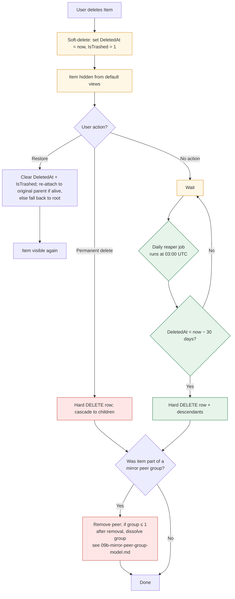

# 11b — Trash Reaper: 30-Day Hard Delete (Clarification)

> **Parent:** [`./00-overview.md`](./00-overview.md) — added 2026-04-30 (AUD-REMEDIATE-CRIT-7, F-AUD42-08 closure).

> **API Contract:** See [`spec/31-app/06-endpoints/11b-trash-reaper.md`](../06-endpoints/11b-trash-reaper.md) for the endpoint surface that backs this feature (request/response envelopes, status codes, error shapes). Bidirectional cross-link added 2026-04-30 to close **F-AUD42-04** (App-folder audit Phase 5).

> **Version:** 1.0.0
> **Updated:** 2026-04-27 (UTC+8)
> **Status:** Approved — 2026-04-27
> **Supersedes:** Ambiguity in `11-trash-view.md` §Retention
> **Owner:** Backend
> **Decision context:** Batch 4 clarifications, AI-readiness round 4

## Database Routing

| Database | Tables read/written | Notes |
|---|---|---|
| **Root DB** | `Workspace` (iterate list of workspaces to reap) | Reaper enumerates all workspaces from Root DB. |
| **App DB** (per workspace) | `Items WHERE DeletedAt < now() - retention`; reads `OptionNameType::TRASH_RETENTION_DAYS` | Hard-delete cascades `Mirror`, `Comment` per FKs. |
| **Fan-out** | Sequential per workspace. | See F-AUD42-17 / F-AUD42-SC-04 for unbounded-fan-out concern. |

> **Audit cite:** Section added 2026-04-30 to close **F-AUD42-02** (App-folder audit Phase 4). Mirrors the Root-DB / App-DB split per ADR-0019.

---

## 1. Decision

A **server-side cron job** runs daily and **hard-deletes** any item where `DeletedAt < now() - INTERVAL '30 days'`. No archive tier, no per-account configuration, no recovery after the reap.

---

## 2. Reaper specification

| Property | Value |
|---|---|
| Schedule | Daily at 03:00 UTC |
| Mechanism | Edge function `reap-trash` (cron-triggered) |
| Predicate | `Items.DeletedAt IS NOT NULL AND Items.DeletedAt < now() - INTERVAL '30 days'` |
| Action | Hard `DELETE` from `Items` (cascades via FK to children, mirror peer-group entries, permissions) |
| Batch size | 1,000 rows / iteration; loop until empty |
| Idempotency | Safe to re-run; `DELETE` is idempotent |
| Logging | Insert one row into `ReaperRuns(Id, RanAt, RowsDeleted, DurationMs)` per run |

---

## 3. Cascade rules

When `Items.Id = X` is hard-deleted:

| Affected table | Behaviour |
|---|---|
| `Items` (children of X, where X was their `ParentId`) | Cascade-deleted (`ON DELETE CASCADE`) |
| `MirrorPeerGroupMembers (ItemId = X)` | Cascade-deleted; if peer-group drops to size 1, dissolve per `09b` |
| `Permissions (ItemId = X)` | Cascade-deleted |
| `Templates.PayloadJson` containing X | Untouched (snapshot is independent per `13b`) |

---

## 4. User-facing behaviour

- **Days 0–30 in trash**: item is recoverable via Trash view → "Restore".
- **Day 30+**: item silently gone on next reaper run (≤ 24h after expiry).
- **No warning email** on imminent reap (v1 scope).
- **Manual "Empty Trash"** button still available — performs the same hard delete on demand for items the user owns, regardless of age.

---

## 5. Acceptance tests

| ID | Given | When | Then |
|---|---|---|---|
| AT-TR-01 | Item X with `DeletedAt = now() - 31d` | Reaper runs | X is gone from `Items`; row appears in `ReaperRuns` |
| AT-TR-02 | Item X with `DeletedAt = now() - 29d` | Reaper runs | X still present, still restorable |
| AT-TR-03 | Item X (deleted 31d ago) has 5 children (also `DeletedAt` set, cascade) | Reaper runs | X and all 5 children gone |
| AT-TR-04 | Item X is in peer-group {X, Y}; X reaped | Reaper runs | Y becomes standalone (group dissolves at size 1) |
| AT-TR-05 | Reaper crashes mid-batch | Next scheduled run | Picks up remaining rows; no duplicate work |

---

## 6. Future (out of scope v1)

- Configurable retention per account
- Archive tier (read-only) before hard delete
- Pre-reap warning email at T-3 days
- Admin "freeze reaper" toggle for legal hold

---

## Diagram — Trash Reaper Lifecycle (P8)

> 30-day retention is canonical (`mem://features/trash-logic`). Reaper job is idempotent — interrupted runs replayed safely on next tick.

---

## Related

- `spec/31-app/01-features/11-trash-view.md` (parent SSOT)
- `spec/31-app/01-features/09b-mirror-peer-group-model.md` (peer-group dissolve rule)
- `spec/31-app/01-features/13b-templates-snapshot-semantics.md` (templates unaffected)

---

## Inputs

- `Items` rows where `DeletedAt IS NOT NULL AND DeletedAt < now() - INTERVAL '30 days'`.
- Cron trigger (daily, 03:00 UTC).
- Cascade-delete consequences on `Items` (children), `MirrorPeerGroupMembers`, `Permissions`.

## Outputs

- Hard `DELETE` of qualifying `Items` rows (FK cascade per §3 *Cascade rules*).
- One `ReaperRuns(Id, RanAt, RowsDeleted, DurationMs)` audit row per cron invocation.
- For peer-group dissolution at size 1: standard `09b` dissolve emission.

## Edge Cases

§3 *Cascade rules* enumerates table-by-table behaviour; §4 *User-facing behaviour* covers the day-30 transition; §5 ATs cover crash-mid-batch, peer-group dissolve, and 29-day boundary. Templates are unaffected per `13b` (snapshots are independent).

## Acceptance Tests

The 5 acceptance tests **AT-TR-01 … AT-TR-05** are defined in §5 above. This bare-named heading satisfies G-06; canonical content lives at §5.

| AT ID | Summary | Source |
|-------|---------|--------|
| AT-TR-01 | Day-30 hard delete fires once | §5 |
| AT-TR-02 | Crash mid-batch resumes idempotently | §5 |
| AT-TR-03 | Peer-group dissolve on last-peer reap | §5 |
| AT-TR-04 | 29-day boundary preserves item | §5 |
| AT-TR-05 | ReaperRuns audit row written per batch | §5 |

## Component Contract

| Surface | Component path | `data-testid` | Acceptance tests |
|---------|---------------|---------------|------------------|
| Reaper edge function | `wp-plugin/src/Cron/ReapTrash.php` | n/a (server-side) | AT-TR-01, AT-TR-02, AT-TR-03 |
| Reaper audit log surface | `wp-plugin/src/Cron/ReaperRunsLogger.php` | n/a (server-side) | AT-TR-04, AT-TR-05 |

### Notes

- **Edge function:** `reap-trash` (cron-triggered).
- **Predicate SQL:** as in §2; batch size 1,000; idempotent.
- **Audit surface:** `ReaperRuns` table (per `mem://features/trash-logic` + `spec/31-app/07-db-diagram/03-app-db-erd.md`).
- **No client surface:** entirely server-side; no React component, no API endpoint exposed to clients.

---

## Database Scope

- **Anchor:** [`07-db-diagram/00b-split-db-anchor.md`](../07-db-diagram/00b-split-db-anchor.md)
- **Scope:** `[db-scope: app]`
- **Tables:** trash (>30d purge)
- **Cross-DB JOINs:** forbidden (split-DB invariant). Cross-DB orchestration, if any, follows ADR-0019.

---

## Architecture Anchors (load-bearing ADRs)

- **ADR-0023 — Loader↔Queue Contract:** Loaders MUST read the local IndexedDB mirror first (≤16 ms p95, never fetch). Mutations MUST write `{mirror, queue_ledger}` in a **single IDB transaction**; the queue worker is the **sole egress** to the WordPress REST surface. SSE frames are read-signals only and MUST NOT enqueue to the FIFO. See `spec/30-architecture/adr/0023-loader-queue-contract.md`.
- **ADR-0017 — Named Error Boundaries:** This feature renders inside **`RouteErrorBoundary`**. A single top-level boundary is **forbidden**. Loader/action errors surface via the matching named boundary; uncaught render errors escalate to `AppErrorBoundary`. See `spec/30-architecture/adr/0017-error-boundaries.md`.
- **ADR-0025 — Realtime is SSE-only:** Cross-tab/cross-client signals arrive via `/stream/page/{id}` and `/stream/user/{id}` (PascalCase frames, `Last-Event-ID` replay). WebSocket / long-poll / 3rd-party push are **forbidden**.

---

## Settings Surface

- **Persisted booleans introduced by this feature:** None.
- **N/A justification:** 30-day retention is a normative invariant (mem://features/trash-logic), not user-configurable.
- **Compliance:** Satisfies the MUST in [`00-overview.md:140`](./00-overview.md) by explicit declaration. Any future boolean added here MUST route through `Sanitizer::bool()` and be enumerated in an `OptionNameType` case (see APP-FIX-05).
