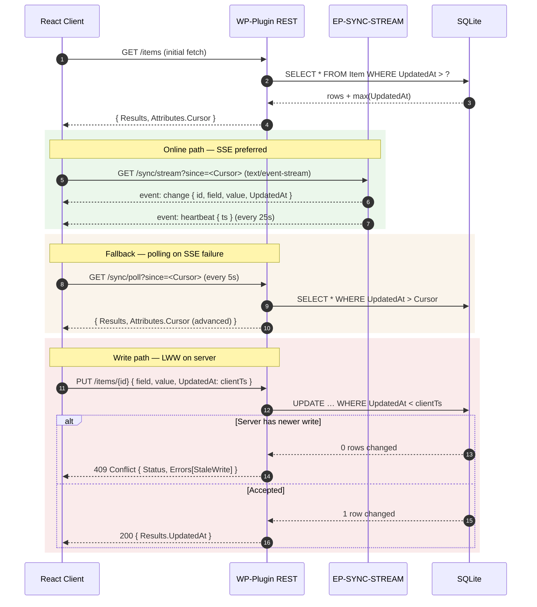

# Concurrency & Sync

> **Version:** 1.8.0
> **Updated:** 2026-04-27 — Linked addendum `14b-offline-queue.md` (full local mirror, FIFO replay, field-level LWW with server timestamp + OwnerId tie-break) and sibling `16-search-ranking.md`. Prior: 2026-04-27 — Polish: added AT-CONCURRENCY-16..22 covering §14.5 SSE contract (endpoint handshake, event frame format, Last-Event-Id resume/replay, cursor-overflow backpressure, poll-fallback shape, transactional emission atomicity, forbidden-transports CI guard) plus 7 matching Component Contract rows (planned WP plugin paths). Closes re-audit §4 item 3. Prior: 2026-04-26 — Re-audit residual fix: §14.2 + §14.4 pseudocode PascalCase'd per Casing Layers rule (closes residual F-08). Prior: 2026-04-26 — Round-3 AUDIT-06: §14.5 SSE Transport Contract added. Prior: 2026-04-26 — AUDIT-02a: snake_case → PascalCase rename. Prior: 2026-04-26 — APP-FIX-08: aspirational-paths disclaimer. Prior: 2026-04-26 — APP-FIX-09: §14.4 `Mirrors.BrokenAt` LWW rule. v1.2.0 added Storage section. v1.1.0 pinned transport to WP-native SSE + poll fallback.
> **Parent:** [00-overview.md](./00-overview.md)
> **Template:** [13-feature-file-template.md](../../01-spec-authoring-guide/13-feature-file-template.md)
> **Addendum:** [`14b-offline-queue.md`](./14b-offline-queue.md) — Offline full local mirror + FIFO replay + LWW resolution.

---

## Overview

This file is the **single source of truth** for how concurrent edits resolve across tabs, devices, and collaborators. Every other feature (mirrors, sharing, multi-select, today, board) defers to the rules here. The MVP strategy is **field-level Last-Write-Wins (LWW)** keyed by **server-issued timestamp** with a deterministic tie-break, plus a visible "Restored remote change" banner whenever a local edit is overwritten. CRDT/OT is out of scope for MVP.

**Transport (per `00-overview.md` L9):** Real-time delivery uses **WP-native Server-Sent Events (SSE)** on a long-lived `text/event-stream` endpoint, with a **5 s polling fallback** when SSE is unavailable (proxy buffering, mobile background, etc.). WebSockets, Postgres `LISTEN/NOTIFY`, and external pub/sub services are explicitly out of scope. Wherever this spec says "realtime channel `item:<id>`" or "realtime broadcast", read it as: *the WP plugin's SSE multiplexer pushes a JSON event over the open SSE connection scoped to that item, OR the next 5 s poll surfaces it*.

## User Story

As a collaborator editing a shared outline at the same time as someone else, I want predictable conflict resolution and a clear notice when my unsaved change is replaced by a peer's, so that I never silently lose work and always know which version is authoritative.

---

## 14.1 Strategy at a Glance

| Concern | MVP Decision |
|---------|--------------|
| Conflict scope | Field-level on the canonical `Item` row (content, note, dateAssigned, completedAt, itemType, parentId, sortKey, color, deletedAt) **and** on `Mirrors.BrokenAt` (see §14.4). |
| Resolution rule | **Last-Write-Wins (LWW)** keyed by `Item.<field>UpdatedAt` (server-stamped). |
| Tie-break | Higher `userId` wins on identical millisecond timestamps. Documented + deterministic. |
| Timestamp source | **Server clock only.** Client clocks are NEVER authoritative. The server stamps every accepted mutation in UTC ms. |
| Causal ordering | Out of scope for MVP. No vector clocks, no Lamport clocks. Re-evaluate Phase 2. |
| User feedback on overwrite | Toast + 1-line banner "Restored remote change" with **Undo** (5 s window) restoring the local value as a new write. |
| Presence | Optional avatar dot on the item row; non-blocking. |
| Mirror sync | All mirrors render from the same source row — same LWW rules apply once. |
| Offline edits | Queued per `mem://features/offline-resilience`; replayed on reconnect with their original local timestamp BUT re-stamped server-side; if server's authoritative row is newer, the queued edit is treated as a normal LWW competitor. |

## 14.2 Field-Level Resolution Algorithm

```
On incoming mutation M for Item I, field F:
  1. Server reads current Item row.
  2. Compare M.ClientAttemptedAt vs server.now() — adopt server.now() as M.ServerTs.
  3. If I.<F>UpdatedAt < M.ServerTs → apply M; set I.<F>UpdatedAt = M.ServerTs.
  4. Else if I.<F>UpdatedAt == M.ServerTs → tie-break by UserId (higher wins).
  5. Else → reject M with conflict response { WinningValue, WinningUserId, WinningTs }.
  6. Broadcast accepted state on the realtime channel for I.
```

Clients receiving a conflict response MUST `[gate: G-25-SSE-CONFLICT-CLIENT-RESTORE]`:
1. Replace their optimistic local value with the server's winning value.
2. Show "Restored remote change" banner with the winning user's avatar.
3. Offer **Undo** (5 s) which submits a fresh write of the local value (subject to the same algorithm).

## 14.3 Phased Roadmap

| Phase | Strategy | Status |
|-------|----------|--------|
| 1 (MVP) | Field-level LWW + UTC server timestamps + tie-break by `userId` | This spec |
| 2 | Per-non-conflicting-field merge + presence indicators | Backlog |
| 3 | CRDT (Yjs) or OT for content/note real-time text co-edit | Backlog |

---

## 14.4 `Mirrors.BrokenAt` — LWW Rule for Mirror Lifecycle

> **Why this section:** [`01-information-model.md`](./01-information-model.md) Edge 7 says "mirrors of any descendant become broken" when an ancestor is trashed, and [`09-Mirrors.md`](./09-mirrors.md) treats a mirror as broken when its `SourceId` is unreachable. Without an explicit LWW rule, a concurrent **restore-from-trash** + **mirror-create** race can flip `BrokenAt` and clear it within milliseconds, producing zombie mirrors. This section pins the deterministic resolution.

### Field

| Column | Type | Meaning |
|--------|------|---------|
| `Mirrors.BrokenAt` | `INTEGER` (UTC ms) NULL | `NULL` = healthy. Non-NULL = the server timestamp at which the source became unreachable (trashed, hard-deleted, or moved out of a shared subtree). |
| `Mirrors.BrokenAtUpdatedAt` | `INTEGER` (UTC ms) NOT NULL | LWW timestamp for `BrokenAt` itself — the *only* value compared during conflict resolution. |
| `Mirrors.BrokenAtUpdatedBy` | `TEXT` (UserId) NOT NULL | Tie-break attribution. `'system'` for reaper / cascade writes. |

### Resolution algorithm (extends §14.2)

```
On incoming write W setting Mirrors.BrokenAt = X (X may be NULL or a timestamp):
  1. Server reads current Mirrors row.
  2. Stamp W.ServerTs = server.now().
  3. If row.BrokenAtUpdatedAt < W.ServerTs → apply (set BrokenAt = X, BrokenAtUpdatedAt = W.ServerTs, BrokenAtUpdatedBy = W.UserId).
  4. Else if row.BrokenAtUpdatedAt == W.ServerTs:
       a. If both writers are 'system' (cascade vs reaper) → keep the row whose value is non-NULL (broken wins over healthy at exact tie).
       b. Else → tie-break by lexicographically higher UserId (same rule as §14.2 step 4); 'system' loses to any human user.
  5. Else → reject W with conflict response { WinningBrokenAt, WinningUserId, WinningTs }.
  6. Broadcast on the SSE channel for the mirror's workspace.
```

### Cascade interactions (normative)

| Scenario | Producer | `BrokenAtUpdatedBy` | Notes |
|----------|----------|---------------------|-------|
| Source trashed (soft-delete cascade) | trash handler | `'system'` | Sets `BrokenAt = serverNow` for every mirror of any descendant of the trashed subtree. |
| Source restored from trash | restore handler | `'system'` | Sets `BrokenAt = NULL` ONLY if the restore's `serverTs` > the mirror's `BrokenAtUpdatedAt`. Older restores lose. |
| Source hard-deleted (30-day reaper) | reaper | `'system'` | Permanent `BrokenAt = serverNow`. Subsequent restores cannot run (source is gone). |
| User manually breaks mirror via UI | human | actual `UserId` | Wins tie-breaks against any `'system'` write at the same `serverTs` (rule 4b). |
| User creates a new mirror with `BrokenAt = NULL` | human | actual `UserId` | New row — no LWW comparison; the row didn't exist. |

### Forbidden patterns

- ❌ Mutating `BrokenAt` without also writing `BrokenAtUpdatedAt = serverNow` and `BrokenAtUpdatedBy`.
- ❌ Resolving "broken vs healthy" with `MAX(BrokenAt)` — the comparison is on `BrokenAtUpdatedAt`, not on `BrokenAt` itself.
- ❌ Letting a stale restore re-heal a mirror whose source has since been hard-deleted (rule 5 rejects it).
- ❌ Treating `'system'` writes as authoritative over human writes at exact ties — they are not (rule 4b).

> **Cross-reference:** [`09-Mirrors.md`](./09-mirrors.md) §Storage shows the `Mirrors` table layout. AT coverage lives in [`97-acceptance-criteria.md`](./97-acceptance-criteria.md) `AT-CONCURRENCY-14..16`.

---

## 14.5 SSE Transport Contract (Round-3 AUDIT-06)

> **Why this section:** §14.1–§14.4 specify the **behavior** of conflict resolution but leave the **wire format** unspecified. Without a fixed transport contract, an implementer must invent event names, payload shapes, resume semantics, and the poll-fallback endpoint — and any guess will diverge from peer code (server-side reaper, mirror broadcaster, offline replay queue) that all consume the same channel. This section pins those choices. SSOT for runtime: WordPress plugin (PHP + SQLite, per `mem://constraints/backend-runtime-deferred`); SSOT for "no WebSockets/Pusher": `00-overview.md` L9.

### 14.5.1 SSE Endpoint

| Aspect | Value |
|--------|-------|
| URL | `GET /wp-json/workflowy/v1/sync/stream?workspaceId={WorkspaceId}` |
| Auth | WP nonce header `X-WP-Nonce`; session cookie required. Reject with `401` otherwise. |
| Response `Content-Type` | `text/event-stream; charset=utf-8` |
| Response headers (required) | `Cache-Control: no-cache, no-transform`, `X-Accel-Buffering: no` (disables nginx buffering), `Connection: keep-alive` |
| Heartbeat | Comment line `:hb\n\n` every **15 s**. Client treats absence > 30 s as a drop. |
| Initial replay | On connect, server replays all events with `ServerTs > Last-Event-Id` (if header present) up to the current cursor, then streams live. |
| Server-side `retry:` | `5000` (ms). Client honors browser default if absent. |
| Backpressure | If the client falls > 1000 events behind, server closes with `event: cursor-overflow` carrying `{ resumeWith: 'poll' }`. Client switches to §14.5.4 poll fallback until next page load. |

### 14.5.2 Event Name Vocabulary (closed set)

Every SSE message has an `event:` line drawn from this list. Unknown events MUST be ignored by the client (forward-compatible) `[gate: G-25-SSE-EVENT-NAMES-CLOSED]`.

| Event | When emitted | `data:` payload (JSON) |
|-------|--------------|------------------------|
| `item-updated` | Any field on `Items` accepted by §14.2 | `{ ItemId, WorkspaceId, ChangedFields: string[], ServerTs, ActorUserId }` |
| `item-deleted` | `Items.DeletedAt` set (soft-delete) | `{ ItemId, WorkspaceId, ServerTs, ActorUserId }` |
| `item-restored` | `Items.DeletedAt` cleared from Trash | `{ ItemId, WorkspaceId, ServerTs, ActorUserId }` |
| `mirror-broken` | `Mirrors.BrokenAt` set non-NULL by §14.4 | `{ MirrorId, SourceId, WorkspaceId, BrokenAt, ServerTs, ActorUserId }` |
| `mirror-healed` | `Mirrors.BrokenAt` cleared by §14.4 | `{ MirrorId, SourceId, WorkspaceId, ServerTs, ActorUserId }` |
| `share-granted` | New row in `Shares` table | `{ ItemId, WorkspaceId, GranteeUserId, Permission, ServerTs, ActorUserId }` |
| `share-revoked` | `Shares` row removed or `RevokedAt` set | `{ ItemId, WorkspaceId, GranteeUserId, ServerTs, ActorUserId }` |
| `presence` | Optional avatar dot per §14.1 | `{ ItemId, WorkspaceId, UserId, State: 'editing' \| 'viewing' \| 'idle' }` — non-authoritative; clients MAY drop on overload |
| `cursor-overflow` | Backpressure (see §14.5.1) | `{ resumeWith: 'poll' }` — client switches to poll mode |
| `:hb` (comment, not `event:`) | Every 15 s | empty — keepalive only |

**Forbidden:** ad-hoc event names (`update`, `change`, `notify`, `broadcast`); JSON envelope keys outside the schemas above; nesting (no event carries another event); binary frames.

### 14.5.3 `id:` Field — Resume Cursor

Every event line MUST include `id: {ServerTs}` `[gate: G-25-SSE-LAST-EVENT-ID]` where `ServerTs` is the integer UTC millisecond stamp from §14.2. The browser auto-sends the last received id as `Last-Event-Id` on reconnect; the server uses it for replay (§14.5.1). The client MUST NOT compare `id` values across workspaces `[gate: G-25-SSE-CURSOR-WORKSPACE-SCOPED]` — the cursor is scoped per `(UserId, WorkspaceId)` and stored in the Root DB `SyncCursor` table (per §Storage).

### 14.5.4 Poll Fallback Endpoint

When SSE is unavailable (proxy strips `text/event-stream`, mobile background, `cursor-overflow`), the client polls every **5000 ms**:

| Aspect | Value |
|--------|-------|
| URL | `GET /wp-json/workflowy/v1/sync/poll?workspaceId={WorkspaceId}&since={LastServerTs}` |
| Auth | Same as §14.5.1 |
| Response `Content-Type` | `application/json` |
| Response shape | `{ Events: Event[], Cursor: ServerTs, HasMore: boolean }` where each `Event` matches one row of §14.5.2 (with an extra `Event: 'item-updated' \| ...` discriminator key in place of the SSE `event:` line). |
| `HasMore = true` | Client polls again immediately (without 5 s wait) until drained. |
| Empty result | `{ Events: [], Cursor: <unchanged>, HasMore: false }`. Cursor never moves backward. |
| Idempotency | Two polls with the same `since` MUST return identical bytes (modulo new events past the cursor) `[gate: G-25-POLL-IDEMPOTENT]`. |

**Forbidden:** long-poll (server holds the request open) — that's a poor approximation of SSE and breaks the 5 s SLA. Use proper SSE when available; otherwise short-poll only.

### 14.5.5 Client Reconnect & Replay Algorithm

```
On client startup OR SSE drop:
  1. Read SyncCursor for (UserId, WorkspaceId) from Root DB → cursor.
  2. Open SSE with header Last-Event-Id: cursor.
  3. On each event: apply locally (per §14.2 / §14.4); update cursor = event.id.
  4. On any of: cursor-overflow event, 30 s without heartbeat, or 3 SSE failures within 60 s
       → switch to poll mode (§14.5.4); set a 60 s probe to retry SSE.
  5. On successful SSE re-open: stop polling.
```

### 14.5.6 Server Emission Rules (normative)

- A successful §14.2 LWW write MUST emit exactly **one** SSE event in the same transaction commit phase (no separate publish step that can drift) `[gate: G-25-SSE-TX-ATOMIC-EMIT]`.
- Failed (rejected) writes MUST NOT emit any event `[gate: G-25-SSE-REJECTED-NO-EMIT]`.
- The `ChangedFields` array in `item-updated` lists **only** the fields whose `<Field>UpdatedAt` advanced; unchanged fields (e.g. tie-break loser fields) are excluded.
- `ActorUserId = 'system'` for reaper / cascade writes (consistent with §14.4 `BrokenAtUpdatedBy`).
- Cross-workspace events are **never** emitted on a workspace stream; the SSE channel is keyed by `(UserId, WorkspaceId)`.

### 14.5.7 Forbidden Transports (reaffirmed)

❌ WebSockets · ❌ Pusher · ❌ Ably · ❌ Supabase Realtime · ❌ Postgres `LISTEN/NOTIFY` · ❌ Redis pub/sub · ❌ Server-managed long-poll · ❌ Custom binary protocol · ❌ Multiple parallel SSE connections per workspace.

---


## Storage

| Layer | Tables | Notes |
|-------|--------|-------|
| **Root DB** | `SyncCursor` (per-user last-seen server timestamp) | Used to resume SSE / poll across reconnects, regardless of which App DB the user is viewing. |
| **App DB** (per workspace) | `Items` + `Mirrors` (LWW field-level columns: `<Field>UpdatedAt`, `<Field>UpdatedBy`), `MutationLog` (server-assigned `ServerTs`, client-supplied `ClientAttemptedAt`) | All conflict resolution happens *inside* one App DB. The LWW algorithm in §14.2 reads/writes only this layer. |
| **Cross-DB joins** | **Forbidden.** | A mutation in one workspace's App DB never references another workspace. SSE channel is keyed by `(UserId, WorkspaceId)`. |

---

## Inputs

| Field | Type | Source | Required | Notes |
|-------|------|--------|----------|-------|
| `itemId` | `string` | URL / state | Yes | The row receiving the mutation |
| `field` | `'content' \| 'note' \| 'dateAssigned' \| 'completedAt' \| 'itemType' \| 'parentId' \| 'sortKey' \| 'color' \| 'deletedAt' \| 'mirrorBrokenAt'` | Mutation request | Yes | One of the LWW-managed columns. `'mirrorBrokenAt'` resolves per §14.4 (target row is `Mirrors`, not `Items`). |
| `newValue` | `unknown` | Mutation payload | Yes | Type matches the field |
| `clientAttemptedAt` | `number` (UTC ms) | Browser clock | No | Logging only — NEVER authoritative |
| `currentUserId` | `string` | Auth session | Yes | Used for tie-break + banner attribution |
| `serverNow` | `number` (UTC ms) | Server clock | Yes | Single authoritative timestamp source |
| `existingFieldTs` | `number` (UTC ms) | DB: `Item.<field>UpdatedAt` | Yes | Compared against `serverNow` |

## Outputs

| Output | Persisted? | Channel | Notes |
|--------|-----------|---------|-------|
| Field accepted | ✅ SQLite | `Item.<field>` UPDATE + `Item.<field>UpdatedAt = serverNow` | Single transaction |
| Field rejected (older) | ❌ DB | Conflict response payload | Includes winning value + ts + userId |
| Realtime broadcast | ❌ | Channel `item:<id>` | All connected peers receive new row state |
| Local optimistic value | ❌ | React state | Replaced on conflict response |
| "Restored remote change" banner | ❌ | Toast bus | 5 s with Undo affordance |
| Undo write | ✅ SQLite | New mutation through same algorithm | Subject to LWW again |
| Conflict log entry | ✅ SQLite | `ConflictLog` (audit) | Records `{Item, Field, LoserUserId, WinnerUserId, ServerTs}` for support |
| Presence dot | ❌ | Realtime presence channel | Optional; non-blocking |

## Edge Cases

1. Two users edit `content` at the same millisecond — tie-break by higher `userId`; loser sees "Restored remote change" with Undo.
2. User A edits offline at T1, user B edits online at T2 (T1 < T2 in real time) — A's queued edit replays at T3 (current server time); LWW compares T3 vs T2 → A's edit wins (intentional: queued edits get fresh server timestamp).
3. User edits a field whose row was just deleted (`deletedAt` set by another user) — reject with conflict toast "Item was deleted by {user}; restore from Trash to keep editing".
4. Mutation arrives with `clientAttemptedAt` 1 hour in the future (client clock skew) — server ignores client clock; uses `serverNow`.
5. User A drags item to parent X (changes `parentId` + `sortKey`); user B drops same item to parent Y simultaneously — both fields LWW independently; final state may be `parentId = X, sortKey = B's` (split-state) — acceptable for MVP per "field-level" guarantee.
6. Item is mirrored — write on a mirror routes to the source row; LWW evaluated on source; all mirror viewers render the new value.
7. User clicks Undo on a "Restored remote change" banner exactly at 5 s boundary — banner closes; click is dropped (no late undo).
8. Network drops during conflict response — client retains optimistic value; on reconnect, server re-broadcasts authoritative state and banner appears retroactively.
9. Server clock jumps backward (NTP correction) — DB constraint: `Item.<field>UpdatedAt` is monotonic per row (use `GREATEST(existingTs + 1, serverNow)`); prevents lost-update.
10. Two users complete a to-do at the same time — both see checkmark; only one `completedAt` value persists; no banner (semantically idempotent — both wanted the same end state).
11. Bulk operation from user A vs single edit from user B on one of A's items — bulk operation is N independent field writes; each row resolves LWW independently.
12. User on a stale tab (background, no realtime connection for 30 min) edits content — on submit, server LWW wins (their `existingFieldTs` is stale by definition); banner shows what they missed.
13. Conflict log fills up (>1M rows) — rotate older than 90 days via cron; never block writes on log retention.
14. Realtime channel disconnects mid-edit — local edit still queues; banner appears on reconnect if overwritten.

## Acceptance Tests

| ID | Given | When | Then | testid |
|----|-------|------|------|--------|
| AT-CONCURRENCY-01 | User A and B both online on same item | A types "foo" at T=100; B types "bar" at T=110 (server ms) | Final `content = "bar"`; A sees banner "Restored remote change" with B's avatar | `concurrency-banner` |
| AT-CONCURRENCY-02 | Two writes at identical server ms; A.userId="u-aa", B.userId="u-bb" | Both writes commit | Higher userId wins ("u-bb") deterministically | `concurrency-tiebreak` |
| AT-CONCURRENCY-03 | "Restored remote change" banner is visible | User clicks Undo within 5 s | Local value re-submitted as a new write; subject to LWW again | `concurrency-undo` |
| AT-CONCURRENCY-04 | Banner is visible | User waits 6 s | Banner auto-dismisses; Undo no longer available | `concurrency-banner` |
| AT-CONCURRENCY-05 | Client clock is 1 hour ahead | User submits edit | Server uses `serverNow`, NOT client clock; LWW comparison correct | `concurrency-server-clock` |
| AT-CONCURRENCY-06 | User A offline-edited at T1; B online-edited at T2 (T1 < T2 real time) | A reconnects; queued edit replays | A's edit wins (re-stamped at reconnect time T3 > T2) | `concurrency-offline-replay` |
| AT-CONCURRENCY-07 | Item deleted by B in another tab | A edits content | Edit rejected; toast "Item was deleted by {B}; restore from Trash to keep editing" | `concurrency-deleted-toast` |
| AT-CONCURRENCY-08 | Item is mirrored in 3 locations | User edits content on mirror M2 | Source updates; all 3 mirror locations render new value within 100 ms | `concurrency-mirror-sync` |
| AT-CONCURRENCY-09 | A and B both check the same to-do at same ms | Both submit | Single `completedAt` persists; no banner shown (idempotent end state) | `concurrency-idempotent` |
| AT-CONCURRENCY-10 | Server NTP corrects clock backward by 5 s | Subsequent edit submitted | `Item.<field>UpdatedAt` is monotonic (`GREATEST(existing+1, serverNow)`); no lost-update | `concurrency-monotonic-ts` |
| AT-CONCURRENCY-11 | A drags item to parent X; B drags same item to parent Y at near-same ts | Both submit | Each field LWW resolves independently; final state may be split (`parentId=X, sortKey=B's`); both see consistent broadcast | `concurrency-split-state` |
| AT-CONCURRENCY-12 | Stale tab (no realtime for 30 min) | User submits edit | Server LWW evaluates against latest row; banner shows missed remote update | `concurrency-stale-tab` |
| AT-CONCURRENCY-13 | Bulk operation on 5 items + concurrent single edit on item 3 | Both submit | Each item resolves LWW independently; bulk loses on item 3 if its edit was newer | `concurrency-bulk-vs-single` |
| AT-CONCURRENCY-14 | Realtime channel disconnects mid-edit | Reconnect happens | If server has newer state, banner appears retroactively | `concurrency-banner` |
| AT-CONCURRENCY-15 | A conflict resolves | Conflict log row inserted | Audit row contains {itemId, field, loserUserId, winnerUserId, serverTs} | `concurrency-conflict-log` |
| AT-CONCURRENCY-16 | Authenticated client opens `GET /wp-json/workflowy/v1/sse?WorkspaceId={id}` | Connection established | Response is `Content-Type: text/event-stream`, `X-Accel-Buffering: no`, no proxy buffering; first line within 1 s is `event: heartbeat` | `sse-endpoint-handshake` |
| AT-CONCURRENCY-17 | SSE stream open | Server sends an `item-updated` event | Frame contains `event: item-updated`, `id: {ServerTs}` (integer ms), and a JSON `data:` payload with `{ItemId, Fields, ServerTs}`; `id` is monotonically non-decreasing across all events on the stream | `sse-event-frame` |
| AT-CONCURRENCY-18 | Client lost connection at `Last-Event-Id: 1700000000123` | Client reconnects with that header | Server replays every event with `ServerTs > 1700000000123` for that `(UserId, WorkspaceId)`, in order, before resuming live emission | `sse-resume-replay` |
| AT-CONCURRENCY-19 | Client falls > 1000 events behind | Server detects backpressure | Server emits `event: cursor-overflow` with `data: {"resumeWith":"poll"}` then closes the connection; client switches to §14.5.4 poll fallback until next page load | `sse-cursor-overflow` |
| AT-CONCURRENCY-20 | SSE unavailable (proxy strips `text/event-stream`) | Client polls `GET /wp-json/workflowy/v1/sync/poll?Cursor={ts}&WorkspaceId={id}` every 5000 ms | Response shape is `{Events: Event[], Cursor: ServerTs, HasMore: boolean}`; each `Event` carries an `Event` discriminator key matching the §14.5.2 vocabulary; no long-polling (server returns immediately) | `sse-poll-fallback` |
| AT-CONCURRENCY-21 | A successful §14.2 LWW write commits in workspace W | Same DB transaction commits | Exactly **one** SSE event is emitted on the `(UserId, WorkspaceId=W)` channel in the same commit phase; the event is **never** broadcast on any other workspace's channel | `sse-emission-atomic` |
| AT-CONCURRENCY-22 | Implementation review of the realtime layer | Code search for forbidden transports | Zero references to WebSockets, Pusher, Ably, Supabase Realtime, Postgres `LISTEN/NOTIFY`, Redis pub/sub, server-managed long-poll, custom binary protocols, or multiple parallel SSE connections per workspace (§14.5.7) | `sse-forbidden-transports` |

## Component Contract

> **Note:** None of these components exist yet — paths are the planned implementation order (aspirational, not normative). The disclaimer mirrors `01-information-model.md` L149 and feeds the global component-contract map (M-3). AI implementers MUST NOT treat the paths as binding imports.

| Surface | Component path | `data-testid` | Acceptance tests |
|---------|---------------|---------------|------------------|
| Restored-remote-change banner | `src/components/concurrency/RemoteChangeBanner.tsx` | `concurrency-banner` | AT-CONCURRENCY-01, 04, 14 |
| Undo button on banner | `src/components/concurrency/UndoRemoteChangeButton.tsx` | `concurrency-undo` | AT-CONCURRENCY-03 |
| Tie-break resolver (server) | `src/server/concurrency/tieBreak.ts` | `concurrency-tiebreak` | AT-CONCURRENCY-02 |
| Server-clock authority module | `src/server/concurrency/serverClock.ts` | `concurrency-server-clock` | AT-CONCURRENCY-05 |
| Offline-replay queue | `src/lib/sync/OfflineReplayQueue.ts` | `concurrency-offline-replay` | AT-CONCURRENCY-06 |
| Item-deleted conflict toast | `src/components/feedback/InfoToast.tsx` | `concurrency-deleted-toast` | AT-CONCURRENCY-07 |
| Mirror sync broadcaster | `src/lib/sync/MirrorSyncBroadcaster.ts` | `concurrency-mirror-sync` | AT-CONCURRENCY-08 |
| Idempotent-write detector | `src/server/concurrency/idempotent.ts` | `concurrency-idempotent` | AT-CONCURRENCY-09 |
| Monotonic-timestamp guard | `src/server/concurrency/monotonicTs.ts` | `concurrency-monotonic-ts` | AT-CONCURRENCY-10 |
| Split-state acceptance | `src/server/concurrency/fieldLevelLWW.ts` | `concurrency-split-state`, `concurrency-bulk-vs-single` | AT-CONCURRENCY-11, 13 |
| Stale-tab banner trigger | `src/lib/sync/StaleTabDetector.ts` | `concurrency-stale-tab` | AT-CONCURRENCY-12 |
| Conflict log writer | `src/server/concurrency/conflictLog.ts` | `concurrency-conflict-log` | AT-CONCURRENCY-15 |
| SSE endpoint handler (WP) | `wp-plugin/Sync/SseEndpoint.php` | `sse-endpoint-handshake` | AT-CONCURRENCY-16 |
| SSE event framer | `wp-plugin/Sync/EventFramer.php` | `sse-event-frame` | AT-CONCURRENCY-17 |
| SSE resume/replay buffer | `wp-plugin/Sync/ResumeBuffer.php` | `sse-resume-replay` | AT-CONCURRENCY-18 |
| Cursor-overflow detector | `wp-plugin/Sync/BackpressureGuard.php` | `sse-cursor-overflow` | AT-CONCURRENCY-19 |
| Poll-fallback endpoint | `wp-plugin/Sync/PollEndpoint.php` | `sse-poll-fallback` | AT-CONCURRENCY-20 |
| Transactional emit hook | `wp-plugin/Sync/TransactionalEmitter.php` | `sse-emission-atomic` | AT-CONCURRENCY-21 |
| Forbidden-transport guard (CI) | `scripts/spec-hygiene/forbidden-transports.mjs` | `sse-forbidden-transports` | AT-CONCURRENCY-22 |

> **Note:** Components are planned paths — none exist yet. Feeds the global component-contract map (M-3).

---

## Diagram — SSE / Poll Handshake (P8)



> Source-of-truth for the LWW tiebreak: `UpdatedAt DESC, Id ASC` per `mem://features/offline-resilience` and `05-conventions/33-state-management-architecture.md` §3.

---

## Related

- [01-information-model.md](./01-information-model.md) — `Item.<field>UpdatedAt` columns required for LWW
- [08-share-dialog.md](./08-share-dialog.md) — concurrency rules apply across share grants
- [09-mirrors.md](./09-mirrors.md) — mirror writes route to source; LWW evaluated once on source
- [12-multi-select.md](./12-multi-select.md) — bulk operations are N independent field writes
- [03-edge-cases/01-edge-cases.md](../03-edge-cases/01-edge-cases.md) — concurrent-edit + clock-skew edge cases
- `mem://features/offline-resilience` — offline queue + reconnect replay
- [`./09a-mirror-cycle-detection.md`](./09a-mirror-cycle-detection.md) — ← Mirror cycle-detection algorithm (forward link from)
- [`./14b-offline-queue.md`](./14b-offline-queue.md) — ← Offline FIFO queue (forward link from)
