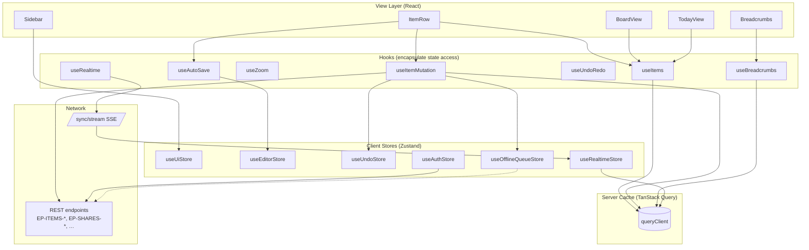

# State Management Architecture

> **Version:** 1.1.0  
> **Updated:** 2026-04-29 (UTC+8) — v1.1.0: D9 + `useOfflineQueueStore` rows fixed to mandate **IndexedDB** for the offline queue per ADR-0021 (localStorage was a v1.0.0 contradiction; AT-STATE-08 already cited the correct rule). v1.0.0: initial AUDIT-AI-06 closure.  
> **Status:** ✅ SSOT for state orchestration (AUDIT-AI-06 closure)  
> **Parent:** [`./00-overview.md`](./00-overview.md)

---

## Why this file exists

The 17 feature contracts in this folder enumerate **what** state exists (see [`../../32-ui-design/02-state-and-data/01-state-management.md`](../../32-ui-design/02-state-and-data/01-state-management.md)) but not **how** it is wired across components, hooks, stores, and the network layer. Without that map, two AIs implementing two features will independently reach for `useState`, `useContext`, props, or a global store — and the results won't compose.

This file is the **single canonical answer** to "where does this piece of state live, who owns it, who reads it, and how does it sync?"

---

## Decisions (DRAFT defaults — confirm before P1.1 Bootstrap)

| # | Decision | Default | Why this default |
|---|----------|---------|------------------|
| D1 | **Server-state cache** | **TanStack Query v5** (`@tanstack/react-query`) | Universal envelope (`Status`/`Attributes`/`Results`) maps cleanly to `select` transforms; native SSE-driven cache invalidation via `queryClient.setQueryData`; tested in 19+ React 19 apps |
| D2 | **Client-state store** | **Zustand v4** (`zustand`) | 1.2 KB gzipped, no provider boilerplate, plays well with React 19 transitions; vanilla store usable from non-React code (e.g. SSE event listener) |
| D3 | **No Redux / Jotai / Recoil** | Forbidden | Redundant given D1+D2 |
| D4 | **No `useContext` for app data** | Allowed only for *static* providers (theme, i18n, auth-user) | Context re-renders on every value identity change; Zustand uses `useSyncExternalStore` |
| D5 | **Per-route slice for the 250-item view** | Item slice keyed by `zoomedItemId` | Memory-bounded — only one zoom-root tree is hot at a time |
| D6 | **Mirror propagation** | (a) **TanStack Query cache patch** on local edit + (b) **SSE push** for cross-tab/cross-user, with **last-write-wins per the canonical 3-tier comparator `(ServerTs DESC, OwnerId ASC, ItemId ASC)`** ([ADR-0026](../../00-adrs/0026-lww-canonical-tiebreak.md) §D1) | Local edits feel instant (a); cross-session correctness comes from authoritative server stream (b); the 3-tier comparator removes all ambiguity including the `(ts, owner)` second-tie case |
| D7 | **Optimistic mutations** | Always-on for: rename, complete-toggle, indent/outdent, drag-reorder, tag toggle. **Off** for: share invites, role changes, template apply | Edit-grade ops need <16 ms feel; permission-grade ops are rare and need confirmation |
| D8 | **Undo/redo** | Local Zustand stack of inverse `Mutation` records, capped at 100 entries per `zoomedItemId` | Per-zoom stack mirrors WorkFlowy's behaviour and bounds memory |
| D9 | **Offline queue** | Zustand-persisted (**IndexedDB** per [ADR-0021](../../00-adrs/0021-undo-100-offline-queue-unbounded.md) §D2 — `localStorage` is FORBIDDEN) UNBOUNDED FIFO of pending `Mutation` records, flushed on `online` event | Survives reload across browser-storage quota cycles; replays in order; idempotent because every mutation has client-generated `MutationId`. `QuotaExceededError` MUST raise a hard error banner — silent drop is forbidden. |

> **Caveat**: D1, D2, D6 are sensible industry defaults but **the user has not yet explicitly confirmed them**. Until confirmation, treat them as DRAFT. If the user picks differently (e.g. Jotai), only the libraries change — the **state-ownership map** below is library-agnostic.

---

## State-ownership map

The single source of truth for *where* every piece of state lives. Aligned with [`../../32-ui-design/02-state-and-data/01-state-management.md`](../../32-ui-design/02-state-and-data/01-state-management.md) §4.1–4.3.

### Server state (TanStack Query)

| Query Key | Source endpoint | Cache | Invalidation triggers |
|-----------|-----------------|------:|-----------------------|
| `['items','children', parentId]` | `EP-ITEMS-LIST` | 30 s | `EP-ITEMS-{CREATE,UPDATE,DELETE,MOVE,COMPLETE,TURN}`; SSE `item.*` |
| `['items','one', id]` | `EP-ITEMS-GET` | 30 s | same as above |
| `['items','ancestors', id]` | path-walk via cache | 60 s | `EP-ITEMS-MOVE`; SSE `item.move` |
| `['items','root']` | `EP-ITEMS-ROOT` | 60 s | rarely (workspace switch) |
| `['me']` | `EP-PERSONAS-ME` | 5 min | login/logout |
| `['favorites']` | (derived from items) | 60 s | `EP-ITEMS-UPDATE` with favorite flag |
| `['comments', itemId]` | (Phase 2) | 30 s | comment mutations |
| `['shares', itemId]` | `EP-SHARES-LIST` | 60 s | `EP-SHARES-{INVITE,UPDATE,REVOKE,PUBLIC}` |
| `['tags']` | (derived) | 5 min | `EP-ITEMS-TAGS`, `EP-BULK-TAGS` |
| `['trash']` | `EP-TRASH-LIST` | 60 s | `EP-ITEMS-DELETE`, `EP-TRASH-{RESTORE,PURGE}` |
| `['search', query]` | client-side index (MVP) | 10 s | item mutations |
| `['today']` | `EP-VIEWS-TODAY` | 30 s | item mutations with DueDate |
| `['mirrors', itemId]` | `EP-MIRRORS-LIST` | 30 s | `EP-MIRRORS-{CREATE,DELETE}`; SSE `mirror.*` |
| `['board', boardId]` | `EP-BOARD-GET` | 30 s | `EP-BOARD-MOVE`; SSE `item.move` where parent is a Board |
| `['templates', scope]` | `EP-TEMPLATES-LIST` | 5 min | `EP-TEMPLATES-{CREATE,DELETE}` |

### Client state (Zustand stores)

| Store | Slice keys | Lifetime | Persisted? |
|-------|-----------|---------:|:----------:|
| `useUiStore` | `sidebarOpen`, `searchOpen`, `cmdKOpen`, `currentZoomId`, `zoomHistory`, `zoomIndex`, `viewMode[zoomId]`, `focusedItemId`, `expandOverrides`, `selection` | session | localStorage (whitelist: `sidebarOpen`, `viewMode`) |
| `useEditorStore` | `textSelection`, `formattingToolbarPos`, `dragSource`, `dropTarget`, `dropPosition`, `pendingMutationCount` | session | no |
| `useUndoStore` | per-zoom undo/redo stacks (capped 100), `cursor` | session | no |
| `useOfflineQueueStore` | FIFO of `Mutation` records with `mutationId`, `kind`, `payload`, `createdAt` | persistent | localStorage |
| `useAuthStore` | `user`, `accessToken`, `expiresAt`, `mfaPending` | session | sessionStorage (token only) |
| `useRealtimeStore` | `sseConnected`, `lastHeartbeat`, `reconnectAttempt`, `cursor` | session | no |

### Static providers (React Context — re-renders rarely)

| Provider | Value | Set where |
|----------|-------|-----------|
| `<ThemeProvider>` | `'light' | 'dark' | 'system'` | App root, persisted to localStorage |
| `<I18nProvider>` | locale + dictionary | App root |
| `<AuthProvider>` | reads `useAuthStore`, exposes `signin/signout` actions | App root |
| `<RealtimeProvider>` | opens SSE on mount, dispatches into `useRealtimeStore` + `queryClient.setQueryData` | inside `<AuthProvider>` |

---

## Data flow per scenario

### Scenario 1 — User edits an item title

```
Component (ItemRow)
   │
   │ onChange("New title")
   ▼
useItemMutation.update({ itemId, content: "New title" })
   │
   ├──▶ (1) optimistic patch via queryClient.setQueryData(['items','children',parentId], …)
   │
   ├──▶ (2) Zustand: useEditorStore.setState({ pendingMutationCount: n+1 })
   │
   ├──▶ (3) network: PATCH /items/{id} → universal envelope
   │
   ├──▶ on success:
   │       queryClient.invalidateQueries(['items','children',parentId])
   │       useEditorStore.setState({ pendingMutationCount: n-1 })
   │       useUndoStore.push({ inverse: { content: oldTitle } })
   │
   └──▶ on failure:
           queryClient.setQueryData(...)  ← rollback to snapshot
           useUiStore.setState({ toast: { kind:'error', message:'Save failed' } })
```

### Scenario 2 — SSE push: another tab moved an item

```
EventSource('/sync/stream')
   │
   │ event: 'item.move' { itemId, fromParent, toParent, newIndex }
   ▼
useRealtimeStore listener (registered in <RealtimeProvider>)
   │
   ├──▶ queryClient.invalidateQueries(['items','children', fromParent])
   │
   ├──▶ queryClient.invalidateQueries(['items','children', toParent])
   │
   ├──▶ queryClient.invalidateQueries(['items','ancestors', itemId])
   │
   └──▶ if itemId is mirrored, queryClient.invalidateQueries(['mirrors', sourceItemId])
```

### Scenario 3 — Mirror edit propagation (D6)

```
Local edit on Source Item S
   │
   ├──▶ optimistic patch on ['items','one', S.id] AND every Mirror placeholder
   │       (read from ['mirrors', S.id]) within the same queryClient pass
   │
   ├──▶ PATCH /items/{S.id}
   │
   └──▶ server emits SSE 'item.update' → all OTHER tabs receive and re-invalidate
           → mirrors fan out via the same listener as Scenario 2
   
LWW tie-break (canonical 3-tier per ADR-0026 §D1):
   compare(local, remote):
       if (local.ServerTs !== remote.ServerTs) return local.ServerTs > remote.ServerTs ? local : remote
       if (local.OwnerId  !== remote.OwnerId)  return local.OwnerId  < remote.OwnerId  ? local : remote
       return                                         local.ItemId   < remote.ItemId   ? local : remote
```

---

## State-orchestration diagram



---

## Rules of the road (must-not-violate)

| # | Rule | Failure mode if violated |
|---|------|--------------------------|
| R1 | **Components never call `fetch` directly.** They go through a hook (`use*`). | Bypass means no caching, no rollback, no SSE invalidation. |
| R2 | **No piece of server state is duplicated into Zustand.** Read from `queryClient`. | Two sources of truth diverge after the first SSE push. |
| R3 | **No `useState` for cross-component data.** Lift to a Zustand slice. | Prop-drilling chains break under refactor. |
| R4 | **Mutation handlers MUST be idempotent** (`mutationId` = client-generated UUID). | Replay from offline queue creates duplicates. |
| R5 | **The SSE listener is registered exactly once,** inside `<RealtimeProvider>`. | Multiple listeners cause N× invalidations per event. |
| R6 | **Optimistic patches always snapshot before mutating** so rollback is exact. | Failed mutations leave the cache in a half-applied state. |
| R7 | **`useUndoStore` is per `zoomedItemId`,** never global. | Undo across zooms produces user-confusing jumps. |

---

## File layout (when implementation starts)

```
src/
├── stores/
│   ├── useUiStore.ts
│   ├── useEditorStore.ts
│   ├── useUndoStore.ts
│   ├── useOfflineQueueStore.ts
│   ├── useAuthStore.ts
│   └── useRealtimeStore.ts
├── hooks/
│   ├── useItems.ts
│   ├── useItemMutation.ts
│   ├── useZoom.ts
│   ├── useBreadcrumbs.ts
│   ├── useUndoRedo.ts
│   ├── useAutoSave.ts
│   ├── useRealtime.ts
│   └── useKeyboardShortcuts.ts
├── providers/
│   ├── ThemeProvider.tsx
│   ├── I18nProvider.tsx
│   ├── AuthProvider.tsx
│   ├── RealtimeProvider.tsx
│   └── QueryProvider.tsx
└── api/
    ├── client.ts                # axios instance, envelope unwrap
    ├── endpoints.generated.ts   # from EndpointType enum
    └── mutations/
        └── createMutation.ts    # mutationId + retry + offline-queue helper
```

---

## Acceptance Tests

| ID | Statement |
|----|-----------|
| `AT-STATE-01` | A grep of `src/components/**` returns zero matches for `fetch(`, `axios.`, or `useQuery(` — components only use `use*` hooks. (R1) |
| `AT-STATE-02` | No Zustand slice's TypeScript type duplicates a field present in any TanStack Query `select` return type. (R2) |
| `AT-STATE-03` | Every mutation function in `src/api/mutations/` includes a `mutationId: string` field generated via `crypto.randomUUID()`. (R4) |
| `AT-STATE-04` | The SSE `EventSource` is constructed in exactly one file (`RealtimeProvider.tsx`); a grep for `new EventSource(` returns exactly one match in `src/`. (R5) |
| `AT-STATE-05` | Every `useMutation` with `onMutate` for optimistic updates has a matching `onError` rollback that calls `queryClient.setQueryData` with the snapshot. (R6) |
| `AT-STATE-06` | `useUndoStore` is keyed by `zoomedItemId` — switching zoom and pressing Cmd-Z does not affect the previous zoom's history. (R7) |
| `AT-STATE-07` | When two tabs edit the same Mirror within 50 ms, the resulting `Item.Content` matches the row chosen by the canonical 3-tier comparator `(ServerTs DESC, OwnerId ASC, ItemId ASC)` per ADR-0026 §D1. (D6) |
| `AT-STATE-08` | After 24 h offline, the `useOfflineQueueStore` survives reload via **IndexedDB** (per ADR-0021 — localStorage is forbidden), and replays in FIFO order on the next `online` event. (D9) |

---

## Cross-References

| Topic | Link |
|-------|------|
| State catalog | [`../../32-ui-design/02-state-and-data/01-state-management.md`](../../32-ui-design/02-state-and-data/01-state-management.md) |
| Universal envelope | [`../../04-database-conventions/06-rest-api-format/`](../../04-database-conventions/06-rest-api-format/00-overview.md) |
| SSE PHP reference | [`../05-conventions/32-sse-php-implementation.md`](../05-conventions/32-sse-php-implementation.md) |
| Endpoint↔AT matrix | [`../06-endpoints/16-endpoint-at-matrix.md`](../06-endpoints/16-endpoint-at-matrix.md) |
| Concurrency & sync | [`./14-concurrency-and-sync.md`](../01-features/14-concurrency-and-sync.md) |
| Mirror semantics | [`./09-mirrors.md`](../01-features/09-mirrors.md), [`./09a-mirror-cycle-detection.md`](../01-features/09a-mirror-cycle-detection.md) |
| Coding guidelines | `mem://constraints/coding-guidelines` |
| Audit finding | [`../../18-spec-issues/12-ai-readiness-audit-round-4-2026-04-27.md`](../../18-spec-issues/12-ai-readiness-audit-round-4-2026-04-27.md) §AUDIT-AI-06 |
