# 01 — Master ERD (All Tables, Both DBs)

> **Version:** 1.0.0
> **Updated:** 2026-04-26 (UTC+8)
> **Parent:** [`./00-overview.md`](./00-overview.md)

---

## What this diagram shows

Every table in **both** Root DB and App DB, with primary keys, foreign keys, and the cross-DB boundary marked. Use this as the canonical "show me everything" view.

> **Reminder (D2)**: arrows that cross the dotted boundary are *logical* relationships only — **no SQL JOIN may cross this boundary**. The lookup goes Root DB → switch connection → App DB.

---

## Diagram

```mermaid
erDiagram
    %% =====================================================
    %% ROOT DB (workflowy_root.db) — identity + workspace
    %% =====================================================
    User ||--o{ WorkspaceMember : "joined to"
    Workspace ||--o{ WorkspaceMember : "has members"
    WorkspaceRoleType ||--o{ WorkspaceMember : "classifies"
    User ||--o{ UserRole : "has system roles"
    RoleType ||--o{ UserRole : "classifies"

    User {
        INTEGER UserId PK
        TEXT Email UK
        TEXT DisplayName
        TEXT Timezone
        BOOLEAN IsActive
        BOOLEAN IsVerified
        TEXT CreatedAt
        TEXT DeletedAt "NULL when active"
    }

    Workspace {
        INTEGER WorkspaceId PK
        INTEGER OwnerUserId FK
        TEXT Name
        TEXT AppDbPath "Path to App DB file"
        TEXT CreatedAt
        TEXT DeletedAt
    }

    WorkspaceMember {
        INTEGER WorkspaceMemberId PK
        INTEGER UserId FK
        INTEGER WorkspaceId FK
        SMALLINT WorkspaceRoleTypeId FK
        TEXT JoinedAt
    }

    WorkspaceRoleType {
        SMALLINT WorkspaceRoleTypeId PK
        TEXT Name "Owner|Admin|Member"
    }

    UserRole {
        INTEGER UserRoleId PK
        INTEGER UserId FK
        SMALLINT RoleTypeId FK
        TEXT AssignedAt
    }

    RoleType {
        SMALLINT RoleTypeId PK
        TEXT Name "admin|user"
    }

    %% =====================================================
    %% APP DB (one file per Workspace) — item tree
    %% Logical link: WorkspaceMember.WorkspaceId selects DB
    %% =====================================================
    Item ||--o{ Item : "parent of"
    ItemType ||--o{ Item : "classifies"
    Item ||--o{ Mirror : "is source of"
    Item ||--o{ ItemTag : "has tags"
    Tag ||--o{ ItemTag : "tags"
    Item ||--o{ Share : "shared via"
    ShareRoleType ||--o{ Share : "classifies"
    Item ||--o{ Comment : "has"
    Item ||--o{ Attachment : "has"
    Item ||--o{ Mention : "contains"
    Item ||--o{ Favorite : "favorited as"
    Item ||--o{ Template : "saved as"
    Item ||--o{ ActivityLog : "logs"

    Item {
        INTEGER ItemId PK
        INTEGER ParentItemId FK "NULL = root"
        INTEGER OwnerUserId FK "Logical FK to Root DB.User"
        SMALLINT ItemTypeId FK
        TEXT Content
        TEXT FractionalIndex
        TEXT DueDate "NULL = no due"
        TEXT CompletedAt "NULL = open"
        INTEGER MirrorOfItemId FK "NULL = canonical (D7)"
        TEXT CreatedAt
        TEXT UpdatedAt
        TEXT DeletedAt "NULL = live (D5)"
    }

    ItemType {
        SMALLINT ItemTypeId PK
        TEXT Name "Bullet|Note|Task|BoardProject|..."
    }

    Mirror {
        INTEGER MirrorId PK
        INTEGER MirrorItemId FK "The placeholder Item row"
        INTEGER SourceItemId FK "The canonical Item (D7)"
        TEXT BrokenAt "NULL = healthy"
        TEXT CreatedAt
    }

    Tag {
        INTEGER TagId PK
        INTEGER OwnerUserId FK
        TEXT Name UK
        TEXT CreatedAt
    }

    ItemTag {
        INTEGER ItemTagId PK
        INTEGER ItemId FK
        INTEGER TagId FK
    }

    Share {
        INTEGER ShareId PK
        INTEGER ItemId FK
        INTEGER GranteeUserId FK "NULL when invited by Email"
        TEXT GranteeEmail "NULL when accepted"
        SMALLINT ShareRoleTypeId FK
        TEXT PublicSlug "NULL when not public"
        BOOLEAN IsPublic
        TEXT CreatedAt
        TEXT RevokedAt
    }

    ShareRoleType {
        SMALLINT ShareRoleTypeId PK
        TEXT Name "Viewer|Editor|Owner"
    }

    Comment {
        INTEGER CommentId PK
        INTEGER ItemId FK
        INTEGER AuthorUserId FK
        TEXT Body
        TEXT CreatedAt
        TEXT DeletedAt
    }

    Attachment {
        INTEGER AttachmentId PK
        INTEGER ItemId FK
        INTEGER UploaderUserId FK
        TEXT FileName
        TEXT MimeType
        INTEGER ByteCount
        TEXT StoragePath
        TEXT CreatedAt
    }

    Mention {
        INTEGER MentionId PK
        INTEGER ItemId FK
        INTEGER MentionedUserId FK
    }

    Favorite {
        INTEGER FavoriteId PK
        INTEGER ItemId FK
        INTEGER UserId FK
        TEXT FractionalIndex "Sidebar order"
        TEXT CreatedAt
    }

    Template {
        INTEGER TemplateId PK
        INTEGER SourceItemId FK
        INTEGER OwnerUserId FK
        TEXT Name
        TEXT Description
        TEXT Payload "JSON: serialized subtree"
        SMALLINT NodeCount
        BOOLEAN IsWorkspaceScoped
        TEXT CreatedAt
    }

    ActivityLog {
        BIGINT ActivityLogId PK
        INTEGER ItemId FK
        INTEGER ActorUserId FK
        TEXT Action "created|updated|moved|deleted|restored|..."
        TEXT PayloadJson
        TEXT CreatedAt
    }

    SyncCursor {
        INTEGER SyncCursorId PK
        INTEGER UserId FK
        TEXT Cursor "Opaque LWW cursor"
        TEXT UpdatedAt
    }
```

---

## Reading the diagram

| Symbol | Meaning |
|--------|---------|
| `||--o{` | One-to-many (the `||` side is the parent / PK side) |
| `}o--o{` | Many-to-many (always via a junction table — never inferred) |
| `PK` | Primary key |
| `FK` | Foreign key |
| `UK` | Unique key (not PK) |

---

## Key constraints not visible in Mermaid

(gate **G-24-DDL-SINGULAR-LOCKED**) These constraints exist but Mermaid `erDiagram` cannot render them. They are normative — every implementation MUST enforce them.

| # | Constraint | Where enforced |
|---|------------|----------------|
| C1 | `Item.MirrorOfItemId IS NOT NULL` ⇒ the referenced row's `MirrorOfItemId IS NULL` (no mirror-of-mirror, D7) | DB trigger or app-layer check |
| C2 | `Item.ParentItemId` cycle prevention (an item cannot be its own ancestor) | App-layer check on `EP-ITEMS-MOVE` |
| C3 | `Item.DeletedAt > date('now', '-30 days')` for restoreable items; older rows are hard-deleted by daily reaper | Background job |
| C4 | `WorkspaceMember` MUST always have ≥ 1 row with `WorkspaceRoleTypeId = Owner` per workspace <!-- (gate **G-24-DDL-SINGULAR-LOCKED**) --> | App-layer check on `EP-ROLES-REVOKE` |
| C5 | `Share.GranteeUserId` XOR `Share.GranteeEmail` — exactly one is non-NULL until invite is accepted | DB `CHECK` constraint |
| C6 | `ItemTag` UNIQUE `(ItemId, TagId)` — no duplicate tag assignments | DB UNIQUE index |
| C7 | `WorkspaceMember` UNIQUE `(UserId, WorkspaceId)` — a user joins a workspace once | DB UNIQUE index |

---

## Cross-References

| Topic | Link |
|-------|------|
| Per-DB ERDs | [`./02-root-db-erd.md`](./02-root-db-erd.md), [`./03-app-db-erd.md`](./03-app-db-erd.md) |
| Per-feature slices | [`./04-feature-slices.md`](./04-feature-slices.md) |
| Indexes serving these tables | [`./06-indexes.md`](./06-indexes.md) |
