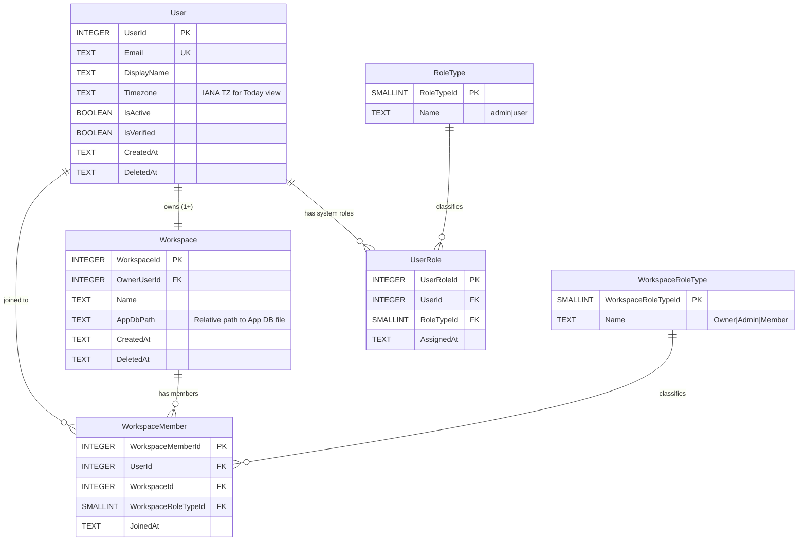

# 02 — Root DB ERD

> **Version:** 1.0.0
> **Updated:** 2026-04-26 (UTC+8)
> **Parent:** [`./00-overview.md`](./00-overview.md)
> **DB file:** `workflowy_root.db` (single instance, system-wide)

---

## What this diagram shows

The **identity + workspace registry** layer. This DB is the **only place** authentication and workspace membership live. `Auth::hasRole()` reads from this DB.

---

## Diagram

---

## Why these tables live here

| Table | Why Root (not App) |
|-------|--------------------|
| `User` | Identity must be queryable independently of any workspace; SSO / login happens before a workspace is selected. |
| `Workspace` | The registry that maps `WorkspaceId → AppDbPath`; needed before any App DB connection is opened. |
| `WorkspaceMember` | `Auth::hasRole()` MUST be answerable without opening an App DB (otherwise an unauthorized user could trigger a DB open). |
| `WorkspaceRoleType` / `RoleType` | Lookup tables that the auth helper joins against. |
| `UserRole` | System-wide role (e.g. `admin` who can manage other users), separate from workspace roles per L8. |

---

## Forbidden in Root DB

- Item content (lives in App DB).
- Comments, attachments, tags (live in App DB).
- Activity log (per-workspace audit trail lives in App DB).
- Search index (per-workspace, lives in App DB or sidecar).

---

## Cross-References

| Topic | Link |
|-------|------|
| Split DB rationale | [`../../05-split-db-architecture/00-overview.md`](../../05-split-db-architecture/00-overview.md) |
| Auth helper contract | [`../01-features/15-roles-and-permissions.md`](../01-features/15-roles-and-permissions.md) §PHP Authorization Helper Contract |
| `EP-ME` reads from this DB | [`../06-endpoints/02-personas.md`](../06-endpoints/02-personas.md) |
| ← Master ERD aggregator (forward link from) | [`./01-master-erd.md`](./01-master-erd.md) |
