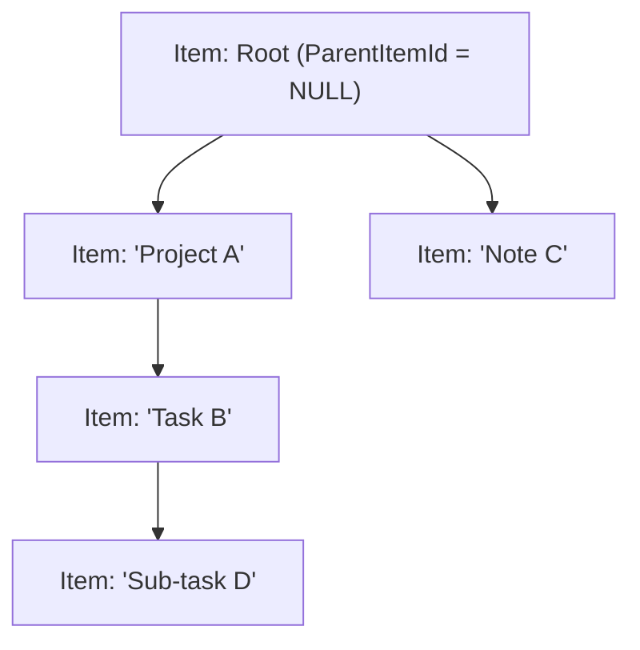

# 03 — App DB ERD (per Workspace)

> **Version:** 1.1.0
> **Updated:** 2026-04-27 (UTC+8) — v1.1.0 added `ReaperRuns` (B4) and `MirrorPeerGroup` + `MirrorPeerGroupMember` (B1) entities; deprecated `Mirror` source/copy table in favour of peer-group model per `mem://features/mirroring`.
> **Parent:** [`./00-overview.md`](./00-overview.md)
> **DB file:** `workflowy_app_{WorkspaceId}.db` (one per workspace)

---

## What this diagram shows

The **item content** layer. Every workspace gets its own App DB file. The unified `Item` table is the centerpiece; everything else hangs off it.

---

## Diagram

```mermaid
erDiagram
    Item ||--o{ Item : "parent of (recursive tree)"
    ItemType ||--o{ Item : "classifies"
    Item ||--o{ Mirror : "is canonical source of (DEPRECATED — see MirrorPeerGroup)"
    MirrorPeerGroup ||--o{ MirrorPeerGroupMember : "contains"
    Item ||--o{ MirrorPeerGroupMember : "is peer in"
    Item ||--o{ ItemTag : "has tags"
    Tag ||--o{ ItemTag : "tags"
    Item ||--o{ Share : "shared via"
    ShareRoleType ||--o{ Share : "classifies"
    Item ||--o{ Comment : "has"
    Item ||--o{ Attachment : "has"
    Item ||--o{ Mention : "contains"
    Item ||--o{ Favorite : "favorited as"
    Item ||--o| Template : "saved as"
    Item ||--o{ ActivityLog : "logged in"
    ReaperRuns }o--|| Item : "audits hard-deletes of"

    Item {
        INTEGER ItemId PK
        INTEGER ParentItemId FK "NULL = root level"
        INTEGER OwnerUserId "Logical FK to Root DB"
        SMALLINT ItemTypeId FK
        TEXT Content "Rich text body"
        TEXT FractionalIndex "String key, NOT integer"
        TEXT DueDate "ISO date, NULL = no due"
        TEXT CompletedAt "NULL = open"
        INTEGER MirrorOfItemId FK "NULL = canonical"
        TEXT CreatedAt
        TEXT UpdatedAt
        TEXT DeletedAt "NULL = live (Trash = NOT NULL)"
    }

    ItemType {
        SMALLINT ItemTypeId PK
        TEXT Name "12 types — see enums-index"
    }

    Mirror {
        INTEGER MirrorId PK
        INTEGER MirrorItemId FK "The placeholder Item row"
        INTEGER SourceItemId FK "The canonical Item"
        TEXT BrokenAt "LWW per §14.4"
        TEXT CreatedAt
    }

    Tag {
        INTEGER TagId PK
        INTEGER OwnerUserId
        TEXT Name UK
        TEXT CreatedAt
    }

    ItemTag {
        INTEGER ItemTagId PK
        INTEGER ItemId FK
        INTEGER TagId FK
    }

    Share {
        INTEGER ShareId PK
        INTEGER ItemId FK
        INTEGER GranteeUserId "NULL until accepted"
        TEXT GranteeEmail "NULL after accepted"
        SMALLINT ShareRoleTypeId FK
        TEXT PublicSlug
        BOOLEAN IsPublic
        TEXT CreatedAt
        TEXT RevokedAt
    }

    ShareRoleType {
        SMALLINT ShareRoleTypeId PK
        TEXT Name "Viewer|Editor|Owner"
    }

    Comment {
        INTEGER CommentId PK
        INTEGER ItemId FK
        INTEGER AuthorUserId
        TEXT Body
        TEXT CreatedAt
        TEXT DeletedAt
    }

    Attachment {
        INTEGER AttachmentId PK
        INTEGER ItemId FK
        INTEGER UploaderUserId
        TEXT FileName
        TEXT MimeType
        INTEGER ByteCount
        TEXT StoragePath
        TEXT CreatedAt
    }

    Mention {
        INTEGER MentionId PK
        INTEGER ItemId FK
        INTEGER MentionedUserId
    }

    Favorite {
        INTEGER FavoriteId PK
        INTEGER ItemId FK
        INTEGER UserId
        TEXT FractionalIndex
        TEXT CreatedAt
    }

    Template {
        INTEGER TemplateId PK
        INTEGER SourceItemId FK
        INTEGER OwnerUserId
        TEXT Name
        TEXT Description
        TEXT Payload "JSON serialized subtree"
        SMALLINT NodeCount
        BOOLEAN IsWorkspaceScoped
        TEXT CreatedAt
    }

    ActivityLog {
        BIGINT ActivityLogId PK
        INTEGER ItemId FK
        INTEGER ActorUserId
        TEXT Action
        TEXT PayloadJson
        TEXT CreatedAt
    }

    SyncCursor {
        INTEGER SyncCursorId PK
        INTEGER UserId
        TEXT Cursor
        TEXT UpdatedAt
    }

    MirrorPeerGroup {
        INTEGER MirrorPeerGroupId PK
        TEXT CreatedAt
        TEXT DissolvedAt "NULL = active; set on singleton dissolution"
    }

    MirrorPeerGroupMember {
        INTEGER MirrorPeerGroupMemberId PK
        INTEGER MirrorPeerGroupId FK
        INTEGER ItemId FK "Each Item appears in at most one group"
        TEXT JoinedAt
        TEXT DetachedAt "NULL = still a peer"
    }

    ReaperRuns {
        INTEGER ReaperRunId PK
        TEXT RanAt "ISO timestamp; indexed DESC for audit list"
        INTEGER RowsDeleted
        INTEGER BatchCount
        INTEGER DurationMs
        BOOLEAN DryRun
    }
```

> **Migration note (Mirror → MirrorPeerGroup)**: `Mirror` and `Item.MirrorOfItemId` remain in v1.1.0 for backwards compatibility but are **deprecated**. New code MUST write to `MirrorPeerGroup` + `MirrorPeerGroupMember`. A migration in `07-migrations.md` (planned) will backfill: every `(Source, Mirror)` pair becomes a 2-member group, then both `Mirror` and `Item.MirrorOfItemId` are dropped.

---

## The recursive `Item` self-relationship

`Item.ParentItemId → Item.ItemId` is the heart of the outliner. Every navigation, breadcrumb, and tree-walk uses this FK.

**Ordering**: siblings are ordered by `FractionalIndex` (a string key), not by integer position. Inserting between two siblings produces a new fractional key without renumbering.

---

## Logical FKs to Root DB

| Column | References | Why logical (not physical) |
|--------|------------|---------------------------|
| `Item.OwnerUserId` | `Root DB.User.UserId` | Cross-DB; enforced at app layer. |
| `Comment.AuthorUserId` | `Root DB.User.UserId` | Same. |
| `Share.GranteeUserId` | `Root DB.User.UserId` | Same. |
| `Mention.MentionedUserId` | `Root DB.User.UserId` | Same. |
| `Favorite.UserId` | `Root DB.User.UserId` | Same. |
| `Template.OwnerUserId` | `Root DB.User.UserId` | Same. |

**Per D2**: SQLite cannot enforce these FKs across files. The app layer MUST validate the user exists in Root DB before insert.

---

## Cross-References

| Topic | Link |
|-------|------|
| Item interface contract | `mem://architecture/data-model` |
| 12 item types | [`../../20-enums-index.md`](../../20-enums-index.md) §2 |
| Per-feature slices | [`./04-feature-slices.md`](./04-feature-slices.md) |
