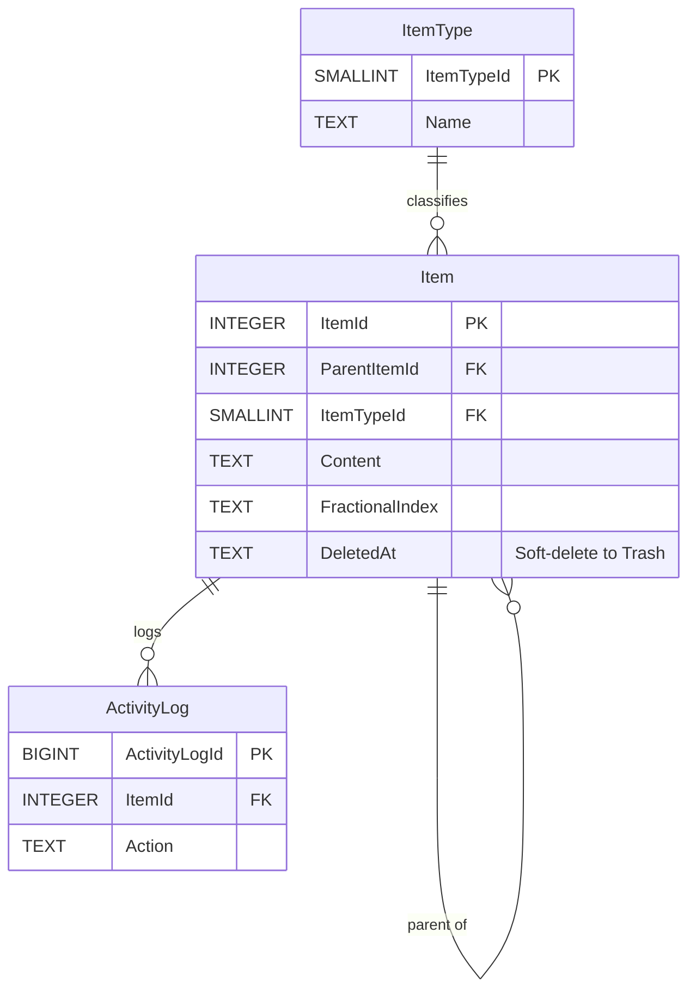
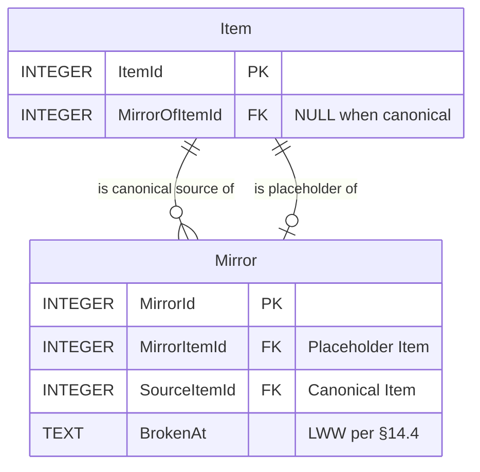
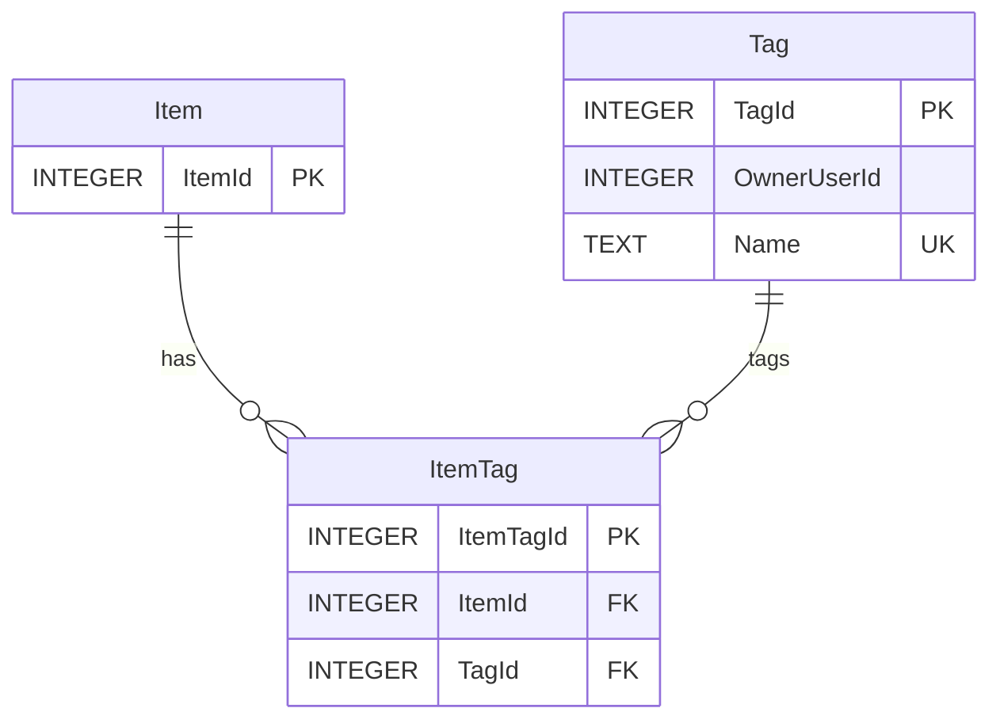
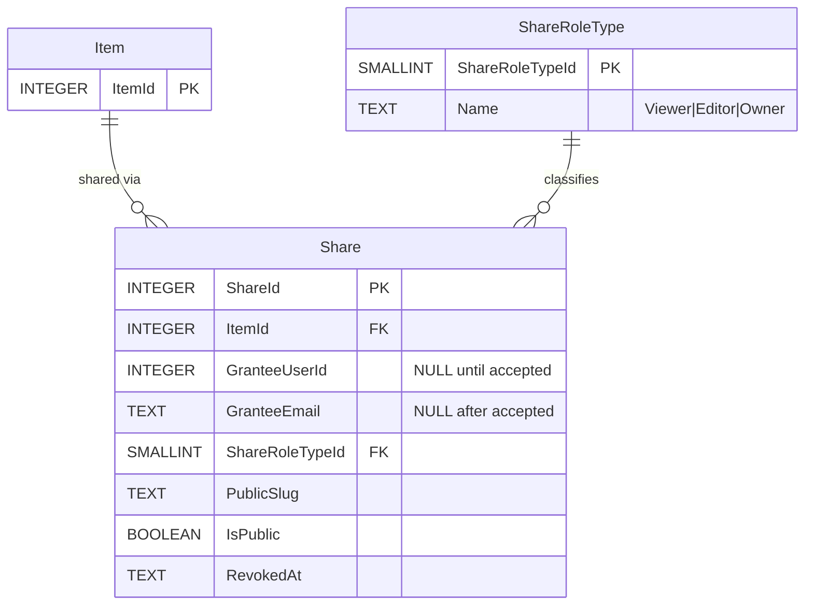
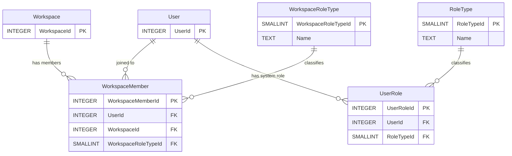
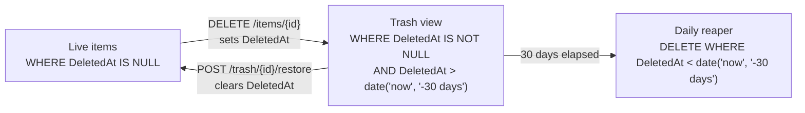
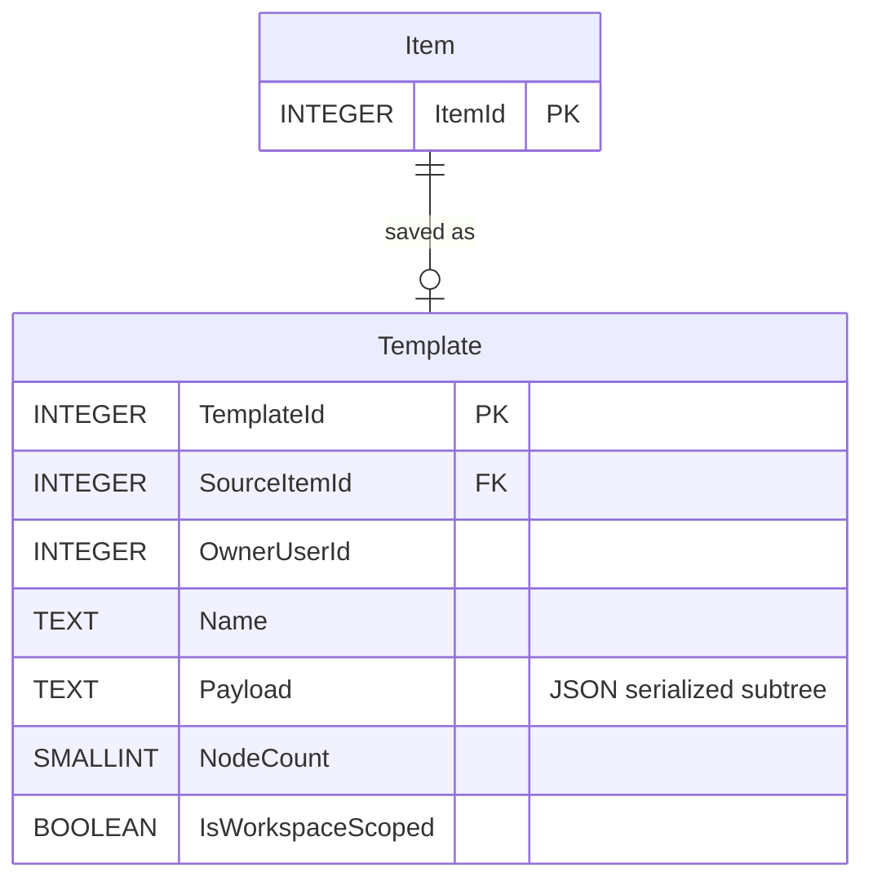
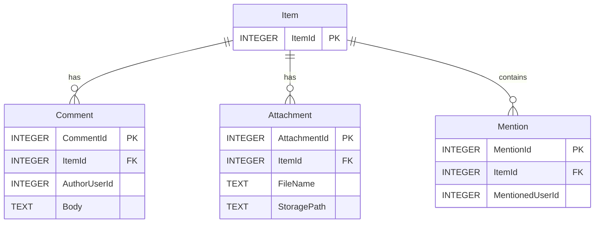
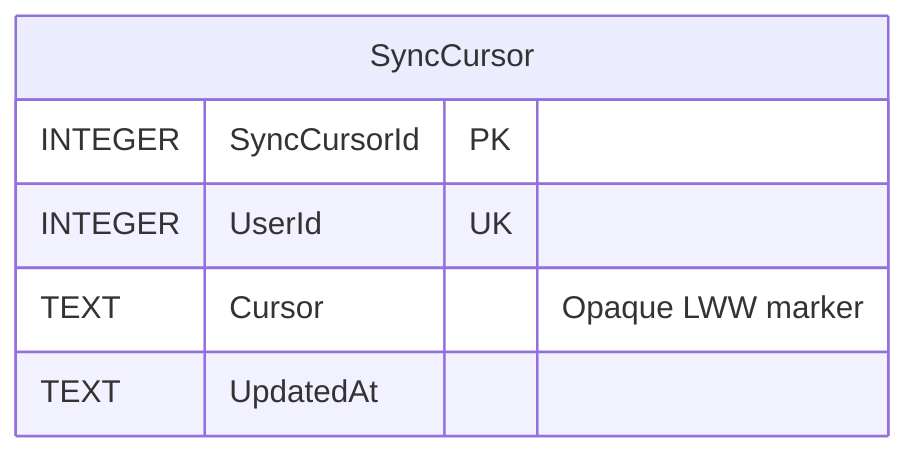

# 04 — Feature Slices (One ERD per Feature)

> **Version:** 1.0.0
> **Updated:** 2026-04-26 (UTC+8)
> **Parent:** [`./00-overview.md`](./00-overview.md)

---

## What this file contains

A small Mermaid ERD per feature, showing **only the tables that feature touches**. Use these slices when you only care about one feature and the master ERD is too noisy.

Every slice mirrors a file in [`../01-features/`](../01-features/00-overview.md) and [`../06-endpoints/`](../06-endpoints/00-overview.md).

---

## 4.1 — Item CRUD (mirrors `01-information-model.md`)

**Endpoints**: `EP-ITEMS-LIST`, `EP-ITEMS-GET`, `EP-ITEMS-CREATE`, `EP-ITEMS-UPDATE`, `EP-ITEMS-MOVE`, `EP-ITEMS-DELETE`, `EP-ITEMS-ROOT`.

---

## 4.2 — Mirrors (mirrors `09-mirrors.md`)

**Constraint (D7)**: `Mirror.SourceItemId` MUST reference an `Item` whose `MirrorOfItemId IS NULL`. Enforced via DB trigger or app check.

**Endpoints**: `EP-MIRRORS-CREATE`, `EP-MIRRORS-LIST`, `EP-MIRRORS-DELETE`.

---

## 4.3 — Tags (mirrors `01-information-model.md` §1.3)

**Constraint**: `UNIQUE(ItemId, TagId)` on `ItemTag`.

**Endpoints**: `EP-ITEMS-TAGS`, `EP-BULK-TAGS`.

---

## 4.4 — Sharing (mirrors `08-share-dialog.md`)

**Constraint (C5)**: `Share.GranteeUserId XOR Share.GranteeEmail` — exactly one is non-NULL.

**Endpoints**: `EP-SHARES-LIST`, `EP-SHARES-INVITE`, `EP-SHARES-UPDATE`, `EP-SHARES-REVOKE`, `EP-SHARES-PUBLIC`.

---

## 4.5 — Roles (mirrors `15-roles-and-permissions.md`)

**All in Root DB.** `Auth::hasRole()` reads here only.

**Constraint (C4)**: at least one `WorkspaceMember` per `Workspace` with `WorkspaceRoleTypeId = Owner`.

**Endpoints**: `EP-ROLES-LIST`, `EP-ROLES-ASSIGN`, `EP-ROLES-REVOKE`.

---

## 4.6 — Trash (a query, not a table)

**Per D5**: there is no `Trash` table. The Trash view is a query over `Item.DeletedAt`.

**Endpoints**: `EP-TRASH-LIST`, `EP-TRASH-RESTORE`, `EP-TRASH-PURGE-ONE`, `EP-TRASH-PURGE-ALL`.

---

## 4.7 — Templates (mirrors `13-templates.md`)

**Note**: applying a template inserts **new `Item` rows with new IDs** — the `Template.Payload` JSON is the schema; instantiated items are fresh rows with no FK back to the template.

**Endpoints**: `EP-TEMPLATES-LIST`, `EP-TEMPLATES-CREATE`, `EP-TEMPLATES-GET`, `EP-TEMPLATES-APPLY`, `EP-TEMPLATES-DELETE`.

---

## 4.8 — Comments + Attachments + Mentions

**Mirror inheritance**: per `01-information-model.md` §1.3, comments belong to the source item — mirrors do not have their own comment rows; they read the source's comments.

---

## 4.9 — Sync Cursor (mirrors `14-concurrency-and-sync.md`)

One row per user. Advanced by `EP-SYNC-ACK`. Used by `EP-SYNC-STREAM` (resume) and `EP-SYNC-POLL` (since-cursor query).

---

## Cross-References

| Topic | Link |
|-------|------|
| Master ERD | [`./01-master-erd.md`](./01-master-erd.md) |
| Lifecycle flows | [`./05-lifecycle-flows.md`](./05-lifecycle-flows.md) |
| Endpoints | [`../06-endpoints/00-overview.md`](../06-endpoints/00-overview.md) |
