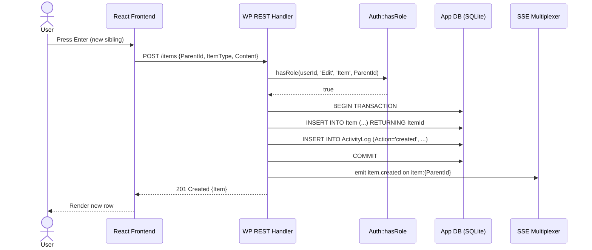
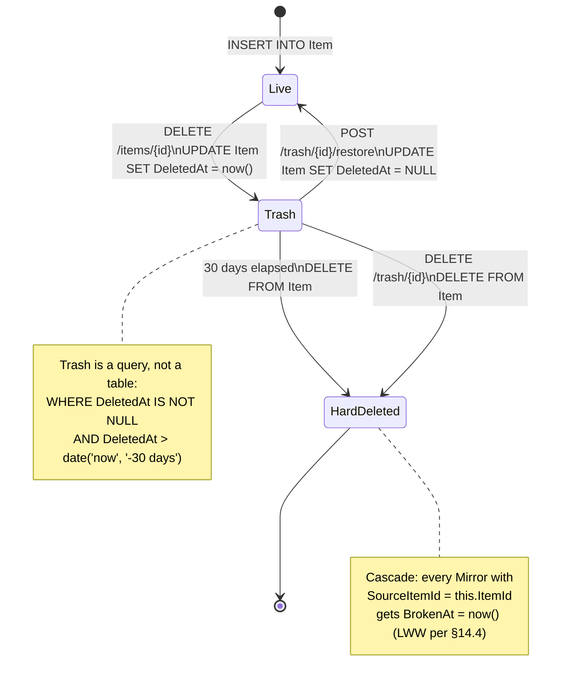
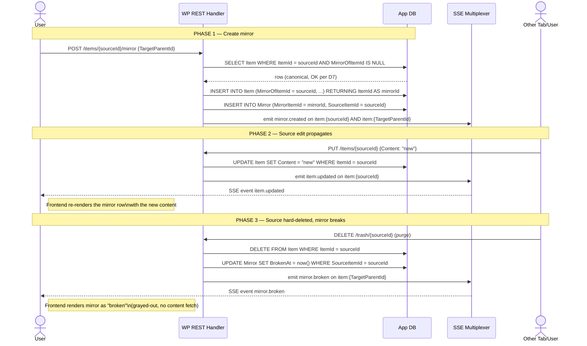
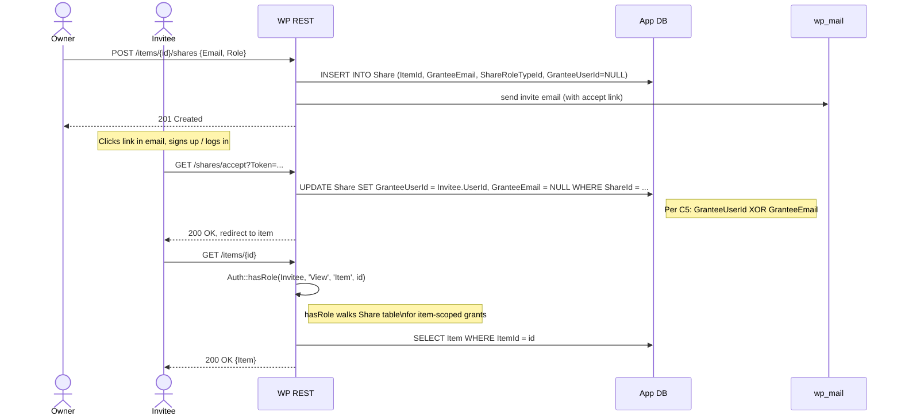
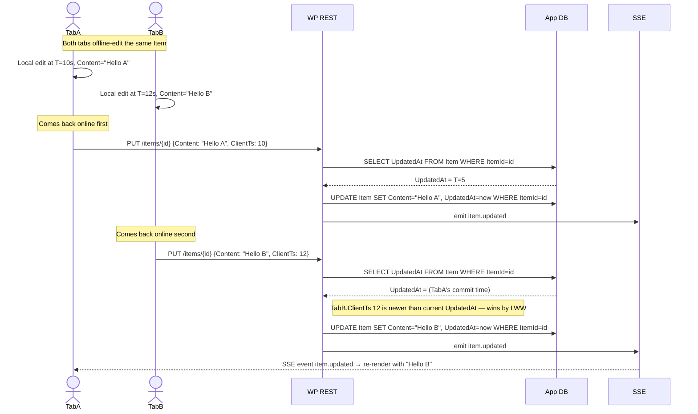
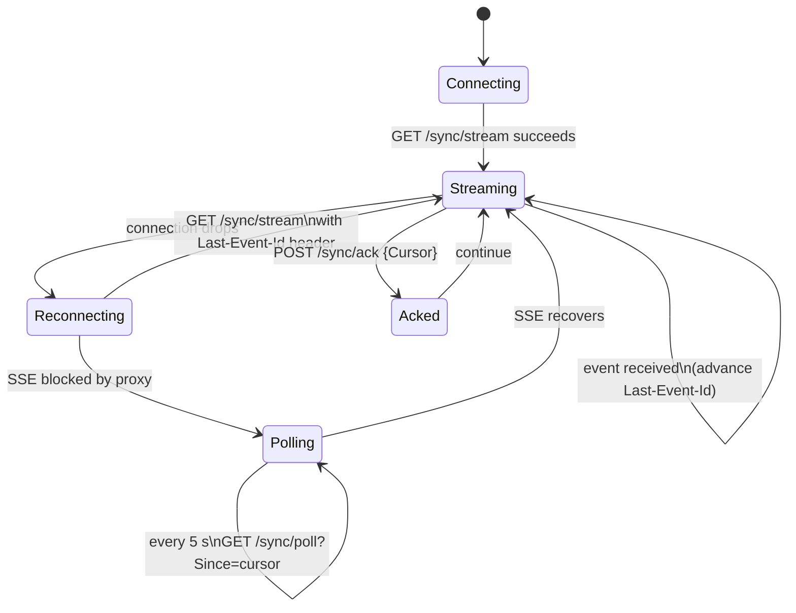

# 05 — Lifecycle Flows

> **Version:** 1.0.0
> **Updated:** 2026-04-26 (UTC+8)
> **Parent:** [`./00-overview.md`](./00-overview.md)

---

## What this file contains

`sequenceDiagram` and `stateDiagram` views of the most error-prone lifecycles. Each shows: the actor, every DB write, and every SSE event emitted. These are the diagrams an AI implementer should consult when writing the corresponding endpoint handler.

---

## 5.1 — Item Create (`EP-ITEMS-CREATE`)

---

## 5.2 — Item Soft-Delete → Trash → Restore

---

## 5.3 — Mirror Create → Source Edit → Mirror Broken

---

## 5.4 — Share Invite → Accept → Use

---

## 5.5 — Conflict Resolution (LWW per §14.4)

---

## 5.6 — Sync Resume (SSE → poll fallback)

---

## Cross-References

| Topic | Link |
|-------|------|
| Endpoint contracts | [`../06-endpoints/`](../06-endpoints/00-overview.md) |
| Conflict resolution rules | [`../01-features/14-concurrency-and-sync.md`](../01-features/14-concurrency-and-sync.md) §14.4 |
| Trash retention | `mem://features/trash-logic` |
| Mirror semantics | [`../01-features/09-mirrors.md`](../01-features/09-mirrors.md) |
| ← Per-feature slices reference these lifecycles (forward link from) | [`./04-feature-slices.md`](./04-feature-slices.md) |
