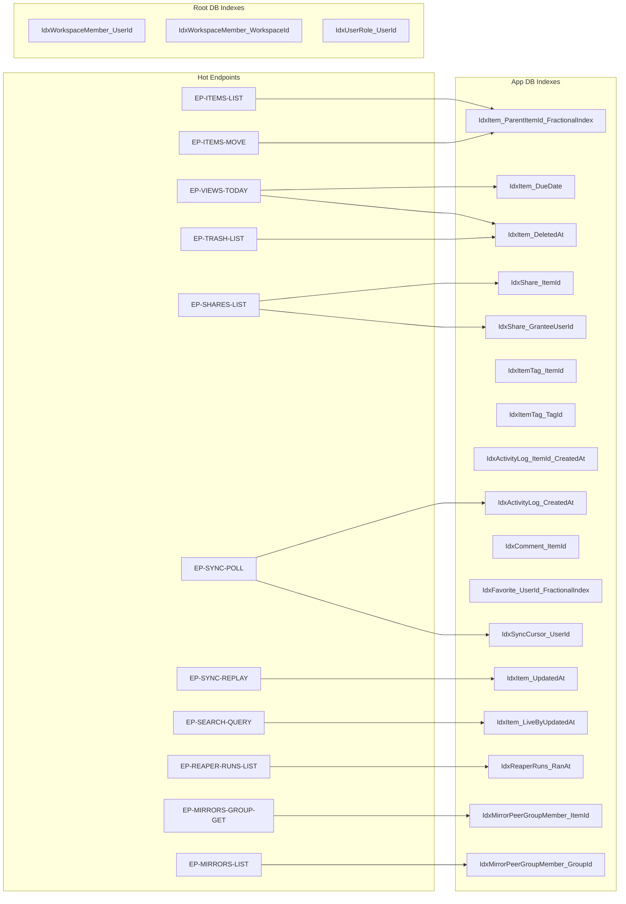

# 06 — Indexes

> **Version:** 1.5.0
> **Updated:** 2026-04-27 (UTC+8) — v1.5.0 (F-future-G32b) added missing `IdxMirrorPeerGroup_CanonicalItemId` row to Required-Indexes table — DDL emits it as `IdxMirrorGroup_CanonicalItemId` (`03-app-indexes.sql:42`); only the deprecation note mentioned the prose alias before, so neither name appeared in any backticked Required-Indexes cell. Caught by gate G-32.3 (CREATE INDEX coverage, UNIQUE + plain) on first run. v1.4.0 (F26) closed three audit findings: (1) corrected `IdxMirrorPeerGroupMember_ItemId` from "UNIQUE partial WHERE DetachedAt IS NULL" → "UNIQUE full-table" (no `DetachedAt` column exists in DDL; detach is row DELETE per `02-workflows/08-mirror-detach-flow.md` step 3c — confirmed by `02-app-schema.sql` line 85 + `03-app-indexes.sql` line 38); (2) added missing row for `IdxUserRole_User_Role` (Root DB UNIQUE composite, declared in `01-root-schema.sql` line 97 but never documented); (3) extended §Implicit Indexes from 1 entry to 6 — added `WorkspaceRoleType.Name`, `RoleType.Name`, `Workspace.AppDbPath`, `ItemType.Name`, `ShareRoleType.Name` enum/lookup UNIQUE side-effects. v1.3.0 (F22) audited DDL drift: removed 3 deprecated index rows referencing M-117-dropped columns/tables; demoted `IdxUser_Email` from "Required" to §"Implicit Indexes". v1.2.0 added §Naming bridge footnote. v1.1.0 added 4 indexes (`IdxItem_UpdatedAt`, `IdxItem_LiveByUpdatedAt`, `IdxReaperRuns_RanAt`, `IdxMirrorPeerGroupMember_ItemId`) for B1–B4.
> **Parent:** [`./00-overview.md`](./00-overview.md)

---

## Naming bridge

> The indexes prefixed **`IdxMirrorPeerGroup*`** in the tables below are emitted by `03-app-indexes.sql` as **`IdxMirrorGroup*`** / **`IdxMirrorMember*`** (matching the shorter DDL table names per AUDIT-AI-07). Same indexes, same predicates. Full alias table — including table, column, and index aliases — lives in **[`./sql/00-overview.md`](./sql/00-overview.md) §Naming Bridge**. Do not duplicate the table here; link only.

---

## What this file contains

Every index this database needs, the queries it serves, and why. Naming follows `04-database-conventions/01-naming-conventions.md`: `Idx{Table}_{Column[s]}`.

> **Rule of thumb**: every FK column gets an index (SQLite does NOT auto-index FKs). Every column appearing in a `WHERE` of a hot endpoint gets an index. Every `ORDER BY FractionalIndex` gets a composite `(ParentItemId, FractionalIndex)` index.

---

## Index → Query Map

---

## App DB — Required Indexes

| Index | Columns | Serves | Why |
|-------|---------|--------|-----|
| `IdxItem_ParentItemId_FractionalIndex` | `(ParentItemId, FractionalIndex)` | `EP-ITEMS-LIST`, `EP-ITEMS-MOVE`, every tree walk | Children-of-parent in display order — the single most-run query |
| `IdxItem_DueDate` | `(DueDate)` partial `WHERE DueDate IS NOT NULL` | `EP-VIEWS-TODAY` | Today view scans only items with due dates |
| `IdxItem_DeletedAt` | `(DeletedAt)` partial `WHERE DeletedAt IS NOT NULL` | `EP-TRASH-LIST`, daily reaper | Trash list + reaper cutoff |
| `IdxItem_OwnerUserId` | `(OwnerUserId)` | Per-user item count, role checks | Optional but cheap |
| `IdxShare_ItemId` | `(ItemId)` | `EP-SHARES-LIST` | List grants per item |
| `IdxShare_GranteeUserId` | `(GranteeUserId)` partial `WHERE GranteeUserId IS NOT NULL` | "Items shared with me" view | Reverse share lookup |
| `IdxShare_PublicSlug` | `(PublicSlug)` UNIQUE partial `WHERE PublicSlug IS NOT NULL` | Public link resolver | Slug → item lookup |
| `IdxItemTag_ItemId` | `(ItemId)` | Tag list for an item | FK index |
| `IdxItemTag_TagId` | `(TagId)` | "Items with tag X" search | FK index |
| `IdxItemTag_Item_Tag` | `(ItemId, TagId)` UNIQUE | C6 — no duplicate tags | Enforces uniqueness |
| `IdxComment_ItemId` | `(ItemId)` | Comment thread per item | FK index |
| `IdxAttachment_ItemId` | `(ItemId)` | Attachment list per item | FK index |
| `IdxMention_MentionedUserId` | `(MentionedUserId)` | "Mentions of me" inbox | Reverse mention lookup |
| `IdxFavorite_UserId_FractionalIndex` | `(UserId, FractionalIndex)` | Sidebar render | Per-user favorites in order |
| `IdxTemplate_OwnerUserId` | `(OwnerUserId)` | `EP-TEMPLATES-LIST` scope=mine | FK index |
| `IdxActivityLog_ItemId_CreatedAt` | `(ItemId, CreatedAt DESC)` | Per-item history | Recent-first audit trail |
| `IdxActivityLog_CreatedAt` | `(CreatedAt)` | `EP-SYNC-POLL` since-cursor scan | Time-ordered event drain |
| `IdxSyncCursor_UserId` | `(UserId)` UNIQUE | `EP-SYNC-ACK`, `EP-SYNC-POLL` | One cursor per user |
| `IdxItem_UpdatedAt` | `(UpdatedAt)` | `EP-SYNC-REPLAY` LWW comparison | Per-mutation `ServerItem.UpdatedAt > ClientUpdatedAt` lookup (`mem://features/offline-resilience`) |
| `IdxItem_LiveByUpdatedAt` | `(UpdatedAt DESC)` partial `WHERE DeletedAt IS NULL` | `EP-SEARCH-QUERY` tie-break | Recency tie-break after MatchKind×FieldWeight scoring (`mem://features/search-functionality`) |
| `IdxReaperRuns_RanAt` | `(RanAt DESC)` | `EP-REAPER-RUNS-LIST` | Newest-first audit listing |
| `IdxMirrorPeerGroupMember_ItemId` | `(ItemId)` UNIQUE (full-table) | `EP-MIRRORS-GROUP-GET`, `EP-MIRRORS-DETACH` | Item → peer group lookup; enforces "Item in ≤1 group" invariant. **Full-table UNIQUE, not partial** — detach is performed by row DELETE per `02-workflows/08-mirror-detach-flow.md` step 3c, so a "soft-detach" `DetachedAt` column would be redundant and does not exist (corrected in v1.4.0 / F26) |
| `IdxMirrorPeerGroupMember_GroupId` | `(MirrorPeerGroupId)` | List peers in a group | FK index for fan-out reads |
| `IdxMirrorPeerGroup_CanonicalItemId` | `(CanonicalItemId)` | Canonical-item → group lookup; resolves "what group does this canonical item own?" during peer-group reads | FK fan-out index. Emitted as `IdxMirrorGroup_CanonicalItemId` in `03-app-indexes.sql` (per `sql/00-overview.md` §Index-name aliases). Added to docs in v1.5.0 (F-future-G32b) — gate G-32.3 caught the prior omission |

---

> **v2 deprecation note (v1.3.0)**: This table previously listed `IdxItem_MirrorOfItemId`, `IdxMirror_SourceItemId`, and `IdxMirror_MirrorItemId`. All three were dropped by migration **M-117** when the legacy `Mirror` table and `Item.MirrorOfItemId` column were removed in favour of the peer-group model (per [`./07-migrations.md`](./07-migrations.md) §v1→v2 Mirror Peer-Group Migration). They are replaced by the `IdxMirrorPeerGroupMember_*` rows above.

---

## Root DB — Required Indexes

| Index | Columns | Serves | Why |
|-------|---------|--------|-----|
| `IdxWorkspaceMember_UserId` | `(UserId)` | "What workspaces am I in?" | FK index, hot on every login |
| `IdxWorkspaceMember_WorkspaceId` | `(WorkspaceId)` | "Who is in this workspace?" | FK index, used by `EP-ROLES-LIST` |
| `IdxWorkspaceMember_User_Workspace` | `(UserId, WorkspaceId)` UNIQUE | C7 — one membership row per pair | Enforces uniqueness |
| `IdxUserRole_UserId` | `(UserId)` | `Auth::hasRole()` system-role check | FK index |
| `IdxUserRole_User_Role` | `(UserId, RoleTypeId)` UNIQUE | One role assignment per user-role pair | Declared by `01-root-schema.sql` line 97; prevents duplicate role grants (added v1.4.0 / F26) |

---

## Implicit Indexes (UNIQUE-implied — no explicit `CREATE INDEX`)

> SQLite automatically creates a B-tree index for every `UNIQUE` column or `UNIQUE` constraint. The entries below are emitted by the engine as a side-effect; they are not listed under "Required Indexes" because no `CREATE INDEX` statement exists in the SQL files. The `sqlite_autoindex_*` naming follows SQLite's internal convention. Listed here so query planners and ops engineers can reason about every index that physically exists at runtime.

### Root DB

| Implicit index | Source `UNIQUE` declaration | Effective query |
|----------------|------------------------------|-----------------|
| `sqlite_autoindex_User_*` (logical `IdxUser_Email`) | `Email TEXT NOT NULL UNIQUE` (`01-root-schema.sql:38`) | Login by email |
| `sqlite_autoindex_WorkspaceRoleType_*` | `Name TEXT NOT NULL UNIQUE` (`01-root-schema.sql:22`) | Enum lookup by role-type name during seeding/role checks |
| `sqlite_autoindex_RoleType_*` | `Name TEXT NOT NULL UNIQUE` (`01-root-schema.sql:30`) | Enum lookup by system-role name |
| `sqlite_autoindex_Workspace_*` (logical `IdxWorkspace_AppDbPath`) | `AppDbPath TEXT NOT NULL UNIQUE` (`01-root-schema.sql:54`) | Bootstrap path → workspace lookup; collision detection on workspace-create |

### App DB

| Implicit index | Source `UNIQUE` declaration | Effective query |
|----------------|------------------------------|-----------------|
| `sqlite_autoindex_ItemType_*` | `Name TEXT NOT NULL UNIQUE` (`02-app-schema.sql:29`) | Enum lookup by item-type name |
| `sqlite_autoindex_ShareRoleType_*` | `Name TEXT NOT NULL UNIQUE` (`02-app-schema.sql:37`) | Enum lookup by share-role name |
| `sqlite_autoindex_MirrorMember_*` (composite) | `UNIQUE (MirrorGroupId, ItemId)` (`02-app-schema.sql:84`) | Belt-and-braces dedup; the explicit `IdxMirrorMember_ItemId` (UNIQUE on `ItemId` alone) covers the hot lookup path |
| `sqlite_autoindex_Tag_*` | `UNIQUE (OwnerUserId, Name)` (`02-app-schema.sql:96`) | Tag-name uniqueness per user; "find tag by name" lookup during type-ahead |
| `sqlite_autoindex_Favorite_*` | `UNIQUE (UserId, ItemId)` (`02-app-schema.sql:173`) | Favorite-toggle dedup; "is this item favorited?" lookup. Distinct from the explicit `IdxFavorite_UserId_FractionalIndex` which serves sidebar-render sort order |

---

## Indexes that are **NOT** needed (and why)

| Would-be index | Why skipped |
|----------------|-------------|
| `IdxItem_Content` (full text on Content) | MVP search is client-side; full-text search ships in Phase 2 via FTS5 virtual table, not a btree index |
| `IdxItem_CreatedAt` | No endpoint sorts items by creation; ordering is by `FractionalIndex` |
| ~~`IdxItem_UpdatedAt`~~ | **REVERSED in v1.1.0** — now required for `EP-SYNC-REPLAY` LWW and `EP-SEARCH-QUERY` tie-break. See App DB indexes table above. |
| `IdxComment_AuthorUserId` | "All my comments" is not an MVP view |

> **Add an index only when a real query needs it.** Speculative indexes slow writes and cost storage with zero benefit.

---

## Composite vs single-column choice

When a query has both `WHERE A = ?` and `ORDER BY B`, prefer a composite `(A, B)` index over two single-column indexes — it lets SQLite walk the btree in pre-sorted order.

Example: `EP-ITEMS-LIST` runs `WHERE ParentItemId = ? ORDER BY FractionalIndex`. The composite `IdxItem_ParentItemId_FractionalIndex` serves both the filter and the sort in a single index scan.

---

## Cross-References

| Topic | Link |
|-------|------|
| Naming convention | [`../../04-database-conventions/01-naming-conventions.md`](../../04-database-conventions/01-naming-conventions.md) |
| Endpoint catalogue | [`../06-endpoints/00-overview.md`](../06-endpoints/00-overview.md) |
| ORM / view rules | [`../../04-database-conventions/03-orm-and-views.md`](../../04-database-conventions/03-orm-and-views.md) |
