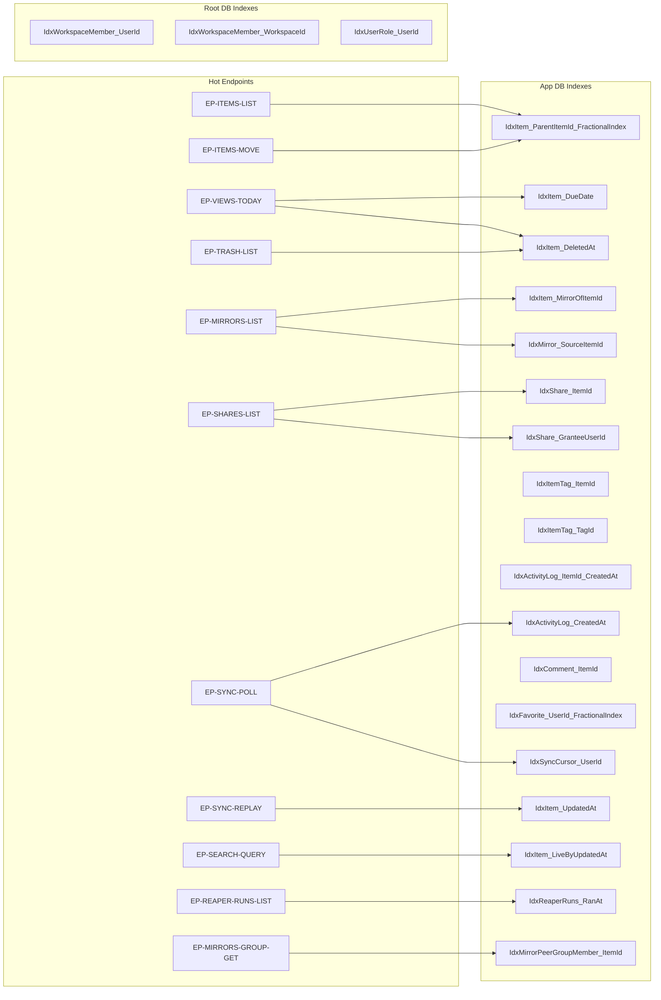

# 06 — Indexes

> **Version:** 1.1.0
> **Updated:** 2026-04-27 (UTC+8) — v1.1.0 added 4 indexes (`IdxItem_UpdatedAt`, `IdxItem_LiveByUpdatedAt`, `IdxReaperRuns_RanAt`, `IdxMirrorPeerGroupMember_ItemId`) for B1–B4; reversed prior "NOT needed" stance on `IdxItem_UpdatedAt` (now required by offline-replay LWW + search tie-break).
> **Parent:** [`./00-overview.md`](./00-overview.md)

---

## What this file contains

Every index this database needs, the queries it serves, and why. Naming follows `04-database-conventions/01-naming-conventions.md`: `Idx{Table}_{Column[s]}`.

> **Rule of thumb**: every FK column gets an index (SQLite does NOT auto-index FKs). Every column appearing in a `WHERE` of a hot endpoint gets an index. Every `ORDER BY FractionalIndex` gets a composite `(ParentItemId, FractionalIndex)` index.

---

## Index → Query Map

---

## App DB — Required Indexes

| Index | Columns | Serves | Why |
|-------|---------|--------|-----|
| `IdxItem_ParentItemId_FractionalIndex` | `(ParentItemId, FractionalIndex)` | `EP-ITEMS-LIST`, `EP-ITEMS-MOVE`, every tree walk | Children-of-parent in display order — the single most-run query |
| `IdxItem_DueDate` | `(DueDate)` partial `WHERE DueDate IS NOT NULL` | `EP-VIEWS-TODAY` | Today view scans only items with due dates |
| `IdxItem_DeletedAt` | `(DeletedAt)` partial `WHERE DeletedAt IS NOT NULL` | `EP-TRASH-LIST`, daily reaper | Trash list + reaper cutoff |
| `IdxItem_MirrorOfItemId` | `(MirrorOfItemId)` partial `WHERE MirrorOfItemId IS NOT NULL` | `EP-MIRRORS-LIST` (find all mirrors of a source) | Reverse mirror lookup |
| `IdxItem_OwnerUserId` | `(OwnerUserId)` | Per-user item count, role checks | Optional but cheap |
| `IdxMirror_SourceItemId` | `(SourceItemId)` | `EP-MIRRORS-LIST`, broken-mirror cascade | Reverse lookup for source-edit fan-out |
| `IdxMirror_MirrorItemId` | `(MirrorItemId)` UNIQUE | One Mirror per placeholder Item | Enforces 1:1 between `Item.MirrorOfItemId` and `Mirror` |
| `IdxShare_ItemId` | `(ItemId)` | `EP-SHARES-LIST` | List grants per item |
| `IdxShare_GranteeUserId` | `(GranteeUserId)` partial `WHERE GranteeUserId IS NOT NULL` | "Items shared with me" view | Reverse share lookup |
| `IdxShare_PublicSlug` | `(PublicSlug)` UNIQUE partial `WHERE PublicSlug IS NOT NULL` | Public link resolver | Slug → item lookup |
| `IdxItemTag_ItemId` | `(ItemId)` | Tag list for an item | FK index |
| `IdxItemTag_TagId` | `(TagId)` | "Items with tag X" search | FK index |
| `IdxItemTag_Item_Tag` | `(ItemId, TagId)` UNIQUE | C6 — no duplicate tags | Enforces uniqueness |
| `IdxComment_ItemId` | `(ItemId)` | Comment thread per item | FK index |
| `IdxAttachment_ItemId` | `(ItemId)` | Attachment list per item | FK index |
| `IdxMention_MentionedUserId` | `(MentionedUserId)` | "Mentions of me" inbox | Reverse mention lookup |
| `IdxFavorite_UserId_FractionalIndex` | `(UserId, FractionalIndex)` | Sidebar render | Per-user favorites in order |
| `IdxTemplate_OwnerUserId` | `(OwnerUserId)` | `EP-TEMPLATES-LIST` scope=mine | FK index |
| `IdxActivityLog_ItemId_CreatedAt` | `(ItemId, CreatedAt DESC)` | Per-item history | Recent-first audit trail |
| `IdxActivityLog_CreatedAt` | `(CreatedAt)` | `EP-SYNC-POLL` since-cursor scan | Time-ordered event drain |
| `IdxSyncCursor_UserId` | `(UserId)` UNIQUE | `EP-SYNC-ACK`, `EP-SYNC-POLL` | One cursor per user |
| `IdxItem_UpdatedAt` | `(UpdatedAt)` | `EP-SYNC-REPLAY` LWW comparison | Per-mutation `ServerItem.UpdatedAt > ClientUpdatedAt` lookup (`mem://features/offline-resilience`) |
| `IdxItem_LiveByUpdatedAt` | `(UpdatedAt DESC)` partial `WHERE DeletedAt IS NULL` | `EP-SEARCH-QUERY` tie-break | Recency tie-break after MatchKind×FieldWeight scoring (`mem://features/search-functionality`) |
| `IdxReaperRuns_RanAt` | `(RanAt DESC)` | `EP-REAPER-RUNS-LIST` | Newest-first audit listing |
| `IdxMirrorPeerGroupMember_ItemId` | `(ItemId)` UNIQUE partial `WHERE DetachedAt IS NULL` | `EP-MIRRORS-GROUP-GET`, `EP-MIRRORS-DETACH` | Item → active peer group lookup; enforces "Item in ≤1 active group" invariant |
| `IdxMirrorPeerGroupMember_GroupId` | `(MirrorPeerGroupId)` | List peers in a group | FK index for fan-out reads |

---

## Root DB — Required Indexes

| Index | Columns | Serves | Why |
|-------|---------|--------|-----|
| `IdxUser_Email` | `(Email)` UNIQUE | Login by email | Already implied by `UNIQUE` constraint on `User.Email` |
| `IdxWorkspaceMember_UserId` | `(UserId)` | "What workspaces am I in?" | FK index, hot on every login |
| `IdxWorkspaceMember_WorkspaceId` | `(WorkspaceId)` | "Who is in this workspace?" | FK index, used by `EP-ROLES-LIST` |
| `IdxWorkspaceMember_User_Workspace` | `(UserId, WorkspaceId)` UNIQUE | C7 — one membership row per pair | Enforces uniqueness |
| `IdxUserRole_UserId` | `(UserId)` | `Auth::hasRole()` system-role check | FK index |

---

## Indexes that are **NOT** needed (and why)

| Would-be index | Why skipped |
|----------------|-------------|
| `IdxItem_Content` (full text on Content) | MVP search is client-side; full-text search ships in Phase 2 via FTS5 virtual table, not a btree index |
| `IdxItem_CreatedAt` | No endpoint sorts items by creation; ordering is by `FractionalIndex` |
| ~~`IdxItem_UpdatedAt`~~ | **REVERSED in v1.1.0** — now required for `EP-SYNC-REPLAY` LWW and `EP-SEARCH-QUERY` tie-break. See App DB indexes table above. |
| `IdxComment_AuthorUserId` | "All my comments" is not an MVP view |

> **Add an index only when a real query needs it.** Speculative indexes slow writes and cost storage with zero benefit.

---

## Composite vs single-column choice

When a query has both `WHERE A = ?` and `ORDER BY B`, prefer a composite `(A, B)` index over two single-column indexes — it lets SQLite walk the btree in pre-sorted order.

Example: `EP-ITEMS-LIST` runs `WHERE ParentItemId = ? ORDER BY FractionalIndex`. The composite `IdxItem_ParentItemId_FractionalIndex` serves both the filter and the sort in a single index scan.

---

## Cross-References

| Topic | Link |
|-------|------|
| Naming convention | [`../../04-database-conventions/01-naming-conventions.md`](../../04-database-conventions/01-naming-conventions.md) |
| Endpoint catalogue | [`../06-endpoints/00-overview.md`](../06-endpoints/00-overview.md) |
| ORM / view rules | [`../../04-database-conventions/03-orm-and-views.md`](../../04-database-conventions/03-orm-and-views.md) |
