# 07 — Migrations Roadmap

> **Version:** 2.0.0
> **Updated:** 2026-04-27 (UTC+8) — v2.0.0 reserves M-115..M-118 for the v1→v2 Mirror Peer-Group migration and ReaperRuns table; adds §"v1→v2 Mirror Peer-Group Migration" execution plan.
> **Parent:** [`./00-overview.md`](./00-overview.md)

---

## What this file contains

The order in which schema migrations MUST be applied to bring a fresh SQLite file to the current schema. Each migration is atomic, idempotent (`IF NOT EXISTS`), and reversible (a paired `down` migration exists in the implementation).

> **Numbering**: `M-NNN-{db}-{verb}-{noun}.sql` where `{db}` is `root` or `app`. Numbers are append-only and never reused.

---

## Migration Dependency Graph

```mermaid
flowchart TD
    classDef root fill:#1e3a8a,stroke:#3b82f6,color:#fff
    classDef app fill:#065f46,stroke:#10b981,color:#fff
    classDef seed fill:#7c2d12,stroke:#ea580c,color:#fff

    M001["M-001-root-create-RoleType<br/>SMALLINT lookup"]:::root
    M002["M-002-root-create-WorkspaceRoleType<br/>SMALLINT lookup"]:::root
    M003["M-003-root-create-User"]:::root
    M004["M-004-root-create-Workspace<br/>FK→User.OwnerUserId"]:::root
    M005["M-005-root-create-WorkspaceMember<br/>FK→User,Workspace,WorkspaceRoleType"]:::root
    M006["M-006-root-create-UserRole<br/>FK→User,RoleType"]:::root
    M007["M-007-root-seed-RoleType<br/>(admin, user)"]:::seed
    M008["M-008-root-seed-WorkspaceRoleType<br/>(Owner, Admin, Member)"]:::seed

    M101["M-101-app-create-ItemType<br/>SMALLINT lookup"]:::app
    M102["M-102-app-create-ShareRoleType<br/>SMALLINT lookup"]:::app
    M103["M-103-app-create-Item<br/>self-FK ParentItemId, FK ItemType"]:::app
    M104["M-104-app-create-Mirror<br/>FK→Item ×2"]:::app
    M105["M-105-app-create-Tag"]:::app
    M106["M-106-app-create-ItemTag<br/>FK→Item,Tag UNIQUE(ItemId,TagId)"]:::app
    M107["M-107-app-create-Share<br/>FK→Item,ShareRoleType"]:::app
    M108["M-108-app-create-Comment<br/>FK→Item"]:::app
    M109["M-109-app-create-Attachment<br/>FK→Item"]:::app
    M110["M-110-app-create-Mention<br/>FK→Item"]:::app
    M111["M-111-app-create-Favorite<br/>FK→Item"]:::app
    M112["M-112-app-create-Template<br/>FK→Item"]:::app
    M113["M-113-app-create-ActivityLog<br/>FK→Item, BIGINT PK"]:::app
    M114["M-114-app-create-SyncCursor<br/>UNIQUE(UserId)"]:::app

    M201["M-201-app-create-indexes<br/>(see 06-indexes.md)"]:::app
    M202["M-202-root-create-indexes<br/>(see 06-indexes.md)"]:::root

    M301["M-301-app-create-views<br/>VwItemDetail, VwBoardView, VwTrashView"]:::app

    M401["M-401-app-seed-ItemType<br/>(Bullet, Note, Task, BoardProject, ...)"]:::seed
    M402["M-402-app-seed-ShareRoleType<br/>(Viewer, Editor, Owner)"]:::seed

    M001 --> M006
    M002 --> M005
    M003 --> M004
    M003 --> M005
    M003 --> M006
    M004 --> M005
    M005 --> M202
    M006 --> M202
    M007 -.runs after.-> M001
    M008 -.runs after.-> M002

    M101 --> M103
    M102 --> M107
    M103 --> M104
    M103 --> M106
    M103 --> M107
    M103 --> M108
    M103 --> M109
    M103 --> M110
    M103 --> M111
    M103 --> M112
    M103 --> M113
    M105 --> M106
    M114 --> M201
    M113 --> M201
    M103 --> M201
    M103 --> M301
    M101 -.seed.-> M401
    M102 -.seed.-> M402
```

---

## Application Order

| Phase | Step | Migrations | DB |
|-------|------|------------|-----|
| **1 — Root bootstrap** | Lookups first | M-001, M-002 | Root |
| | Entities | M-003, M-004, M-005, M-006 | Root |
| | Indexes | M-202 | Root |
| | Seed lookups | M-007, M-008 | Root |
| **2 — App bootstrap (per workspace)** | Lookups first | M-101, M-102 | App |
| | Entities (Item must come before its FK consumers) | M-103 | App |
| | FK consumers of Item | M-104, M-105, M-106, M-107, M-108, M-109, M-110, M-111, M-112, M-113, M-114 | App |
| | Indexes | M-201 | App |
| | Views | M-301 | App |
| | Seed lookups | M-401, M-402 | App |

> **App DB migrations run lazily**: when a new workspace is created, all M-1XX/M-2XX/M-3XX/M-4XX migrations run in order against the new App DB file before the first query.

---

## Migration Hygiene Rules

| # | Rule | Why |
|---|------|-----|
| 1 | Every migration uses `IF NOT EXISTS` for `CREATE TABLE` and `IF NOT EXISTS` for `CREATE INDEX` | Idempotent re-runs after partial failure |
| 2 | Every `up` migration has a paired `down` migration | Enables rollback during dev / failed deploys |
| 3 | Lookup table seeds use explicit IDs (`INSERT INTO RoleType (RoleTypeId, Name) VALUES (1, 'admin')`) | Stable IDs across environments |
| 4 | Never `ALTER TABLE … DROP COLUMN` on a live table — write a new migration that creates a new table, copies data, swaps names | SQLite ALTER limitations |
| 5 | A schema-changing migration MUST bump the App DB's `PRAGMA user_version` | Lets the bootstrap know which migration to run next |
| 6 | Never edit a migration after it has been merged | Append-only — write a new migration to fix mistakes |

---

## Future Migrations (placeholder slots)

These are reserved for Phase 2 features so the numbering stays predictable:

| Slot | Reserved for | Source |
|------|--------------|--------|
| M-115 | `BoardColumn` table (when board view ships) | [`../01-features/07-board-view.md`](../01-features/07-board-view.md) |
| M-116 | `FtsItem` virtual table (FTS5 search index) | `mem://features/search-functionality` |
| M-117 | `Presence` table (cursor / selection broadcast) | [`../01-features/14-concurrency-and-sync.md`](../01-features/14-concurrency-and-sync.md) |

---

## Cross-References

| Topic | Link |
|-------|------|
| Index list | [`./06-indexes.md`](./06-indexes.md) |
| Naming rules | [`../../04-database-conventions/01-naming-conventions.md`](../../04-database-conventions/01-naming-conventions.md) |
| Split DB pattern | [`../../05-split-db-architecture/00-overview.md`](../../05-split-db-architecture/00-overview.md) |
