# 07 — Migrations Roadmap

> **Version:** 2.0.0
> **Updated:** 2026-04-27 (UTC+8) — v2.0.0 reserves M-115..M-118 for the v1→v2 Mirror Peer-Group migration and ReaperRuns table; adds §"v1→v2 Mirror Peer-Group Migration" execution plan.
> **Parent:** [`./00-overview.md`](./00-overview.md)

---

## What this file contains

The order in which schema migrations MUST be applied to bring a fresh SQLite file to the current schema. Each migration is atomic, idempotent (`IF NOT EXISTS`), and reversible (a paired `down` migration exists in the implementation) (gate `G-ADR-0001-AMENDMENT-REQUIRED`).

> **Numbering**: `M-NNN-{db}-{verb}-{noun}.sql` where `{db}` is `root` or `app`. Numbers are append-only and never reused.

---

## Migration Dependency Graph

```mermaid
flowchart TD
    classDef root fill:#1e3a8a,stroke:#3b82f6,color:#fff
    classDef app fill:#065f46,stroke:#10b981,color:#fff
    classDef seed fill:#7c2d12,stroke:#ea580c,color:#fff

    M001["M-001-root-create-RoleType<br/>SMALLINT lookup"]:::root
    M002["M-002-root-create-WorkspaceRoleType<br/>SMALLINT lookup"]:::root
    M003["M-003-root-create-User"]:::root
    M004["M-004-root-create-Workspace<br/>FK→User.OwnerUserId"]:::root
    M005["M-005-root-create-WorkspaceMember<br/>FK→User,Workspace,WorkspaceRoleType"]:::root
    M006["M-006-root-create-UserRole<br/>FK→User,RoleType"]:::root
    M007["M-007-root-seed-RoleType<br/>(admin, user)"]:::seed
    M008["M-008-root-seed-WorkspaceRoleType<br/>(Owner, Admin, Member)"]:::seed

    M101["M-101-app-create-ItemType<br/>SMALLINT lookup"]:::app
    M102["M-102-app-create-ShareRoleType<br/>SMALLINT lookup"]:::app
    M103["M-103-app-create-Item<br/>self-FK ParentItemId, FK ItemType"]:::app
    M104["M-104-app-create-Mirror<br/>FK→Item ×2"]:::app
    M105["M-105-app-create-Tag"]:::app
    M106["M-106-app-create-ItemTag<br/>FK→Item,Tag UNIQUE(ItemId,TagId)"]:::app
    M107["M-107-app-create-Share<br/>FK→Item,ShareRoleType"]:::app
    M108["M-108-app-create-Comment<br/>FK→Item"]:::app
    M109["M-109-app-create-Attachment<br/>FK→Item"]:::app
    M110["M-110-app-create-Mention<br/>FK→Item"]:::app
    M111["M-111-app-create-Favorite<br/>FK→Item"]:::app
    M112["M-112-app-create-Template<br/>FK→Item"]:::app
    M113["M-113-app-create-ActivityLog<br/>FK→Item, BIGINT PK"]:::app
    M114["M-114-app-create-SyncCursor<br/>UNIQUE(UserId)"]:::app

    M201["M-201-app-create-indexes<br/>(see 06-indexes.md)"]:::app
    M202["M-202-root-create-indexes<br/>(see 06-indexes.md)"]:::root

    M301["M-301-app-create-views<br/>VwItemDetail, VwBoardView, VwTrashView"]:::app

    M401["M-401-app-seed-ItemType<br/>(Bullet, Note, Task, BoardProject, ...)"]:::seed
    M402["M-402-app-seed-ShareRoleType<br/>(Viewer, Editor, Owner)"]:::seed

    M001 --> M006
    M002 --> M005
    M003 --> M004
    M003 --> M005
    M003 --> M006
    M004 --> M005
    M005 --> M202
    M006 --> M202
    M007 -.runs after.-> M001
    M008 -.runs after.-> M002

    M101 --> M103
    M102 --> M107
    M103 --> M104
    M103 --> M106
    M103 --> M107
    M103 --> M108
    M103 --> M109
    M103 --> M110
    M103 --> M111
    M103 --> M112
    M103 --> M113
    M105 --> M106
    M114 --> M201
    M113 --> M201
    M103 --> M201
    M103 --> M301
    M101 -.seed.-> M401
    M102 -.seed.-> M402
```

---

## Application Order

| Phase | Step | Migrations | DB |
|-------|------|------------|-----|
| **1 — Root bootstrap** | Lookups first | M-001, M-002 | Root |
| | Entities | M-003, M-004, M-005, M-006 | Root |
| | Indexes | M-202 | Root |
| | Seed lookups | M-007, M-008 | Root |
| **2 — App bootstrap (per workspace)** | Lookups first | M-101, M-102 | App |
| | Entities (Item must come before its FK consumers) | M-103 | App |
| | FK consumers of Item | M-104, M-105, M-106, M-107, M-108, M-109, M-110, M-111, M-112, M-113, M-114 | App |
| | Indexes | M-201 | App |
| | Views | M-301 | App |
| | Seed lookups | M-401, M-402 | App |

> **App DB migrations run lazily**: when a new workspace is created, all M-1XX/M-2XX/M-3XX/M-4XX migrations run in order against the new App DB file before the first query.

---

## Migration Hygiene Rules

| # | Rule | Why |
|---|------|-----|
| 1 | Every migration uses `IF NOT EXISTS` for `CREATE TABLE` and `IF NOT EXISTS` for `CREATE INDEX` | Idempotent re-runs after partial failure |
| 2 | Every `up` migration has a paired `down` migration | Enables rollback during dev / failed deploys |
| 3 | Lookup table seeds use explicit IDs (`INSERT INTO RoleType (RoleTypeId, Name) VALUES (1, 'admin')`) | Stable IDs across environments |
| 4 | Never `ALTER TABLE … DROP COLUMN` on a live table — write a new migration that creates a new table, copies data, swaps names | SQLite ALTER limitations |
| 5 | A schema-changing migration MUST bump the App DB's `PRAGMA user_version` | Lets the bootstrap know which migration to run next (gate `G-ADR-0001-AMENDMENT-REQUIRED`) |
| 6 | Never edit a migration after it has been merged | Append-only — write a new migration to fix mistakes |

---

## Allocated Migration Slots (v2.0)

The following slots are **allocated** (not placeholders) and will be applied as part of the v1→v2 schema upgrade. Their `up` SQL exists in [`./sql/`](./sql/) and is referenced from the execution plan below.

| Slot | Purpose | Source SQL | AT Coverage |
|------|---------|------------|-------------|
| **M-115** | Create `MirrorGroup` + `MirrorMember` tables (peer-group model, AUDIT-AI-07 fix) | [`./sql/07-migration-v2-mirror-peer-groups.sql`](./sql/07-migration-v2-mirror-peer-groups.sql) §Phase 1 | `AT-APP-58..65` |
| **M-116** | Backfill `MirrorGroup` + `MirrorMember` rows from legacy `Mirror` table | [`./sql/07-migration-v2-mirror-peer-groups.sql`](./sql/07-migration-v2-mirror-peer-groups.sql) §Phase 2 | `AT-APP-58..65` |
| **M-117** | Drop legacy `Mirror` table + `Item.MirrorOfItemId` column + their indexes | [`./sql/07-migration-v2-mirror-peer-groups.sql`](./sql/07-migration-v2-mirror-peer-groups.sql) §Phase 3–4 | `AT-APP-58..65` |
| **M-118** | Create `ReaperRuns` audit table (B4 trash-reaper) + `IdxReaperRuns_RanAt` | [`./sql/02-app-schema.sql`](./sql/02-app-schema.sql) §ReaperRuns + [`./sql/03-app-indexes.sql`](./sql/03-app-indexes.sql) | `AT-APP-81..85` |

> **Naming bridge**: ERD docs (`03-app-db-erd.md`, `06-indexes.md`) call these tables `MirrorPeerGroup` / `MirrorPeerGroupMember`. The SQL files use `MirrorGroup` / `MirrorMember` (shorter, matches AUDIT-AI-07 fix). See [`./sql/00-overview.md`](./sql/00-overview.md) §Naming Bridge.

---

## v1→v2 Mirror Peer-Group Migration — Execution Plan

> **Trigger**: WP-plugin bootstrap detects `PRAGMA user_version < 2` on an App DB.
> **Authority**: [`../01-features/09b-mirror-peer-group-model.md`](../01-features/09b-mirror-peer-group-model.md) §8
> **Workflow ref**: [`../02-workflows/08-mirror-detach-flow.md`](../02-workflows/08-mirror-detach-flow.md) (post-migration runtime behaviour)

### Pre-flight checks (per App DB)

| # | Check | Action on fail |
|---|-------|----------------|
| 1 | `PRAGMA user_version` returns `1` (or `0` for legacy installs predating versioning) | Skip migration, log `SKIP: already v{n}` |
| 2 | SQLite version ≥ `3.35.0` (required for `ALTER TABLE … DROP COLUMN`) | Abort, surface error to admin — manual upgrade path required |
| 3 | Legacy `Mirror` table exists OR is already absent | If absent AND new tables present → mark `user_version=2`, exit |
| 4 | Make a file-level backup copy: `workflowy_app_{WorkspaceId}.db.pre-v2.bak` | Abort if backup write fails |

### Execution sequence

| Step | Action | Reversible? | Notes |
|------|--------|:-----------:|-------|
| 1 | `PRAGMA foreign_keys = OFF` | ✅ | Required so Phase 3 drop doesn't trip cascades mid-flight |
| 2 | `BEGIN TRANSACTION` | ✅ | Whole migration is atomic; failure → full rollback |
| 3 | M-115: create `MirrorGroup`, `MirrorMember` (`IF NOT EXISTS`) | ✅ | Idempotent |
| 4 | M-116: backfill — one `MirrorGroup` per distinct `Mirror.SourceItemId`; insert source + each mirror placeholder as members | ✅ | `WHERE NOT EXISTS` guards make it re-runnable |
| 5 | M-117: `DROP INDEX` legacy mirror indexes; `DROP TABLE Mirror`; `ALTER TABLE Item DROP COLUMN MirrorOfItemId` | ⚠️ Destructive | Backup from pre-flight #4 is the only rollback |
| 6 | M-118: ensure `ReaperRuns` exists + its index | ✅ | No-op if v2.1 schema already applied |
| 7 | Recreate v2 indexes (`IF NOT EXISTS`) | ✅ | See [`./06-indexes.md`](./06-indexes.md) §Mirror peer-group |
| 8 | `PRAGMA user_version = 2` | ✅ | Bootstrap marker — gates re-runs |
| 9 | `COMMIT` + `PRAGMA foreign_keys = ON` | — | |
| 10 | Record `wp_options` row `workflowy_migration_v2_{WorkspaceId} = {ISO8601}` | — | Cross-instance audit; survives DB file replacement |

### Failure modes

| Failure | Detection | Response |
|---------|-----------|----------|
| Legacy `Mirror` row references a deleted `Item` (orphan FK after FKs disabled) | Phase 2 INSERT succeeds but member count mismatch with `(SELECT 2*COUNT(*) FROM Mirror) - duplicates` | Log warning, continue — orphans are dropped (matches v2 semantics) |
| Singleton group created (only the source survives) | After Phase 2, `SELECT MirrorGroupId FROM MirrorMember GROUP BY MirrorGroupId HAVING COUNT(*) = 1` | Run [`../02-workflows/08-mirror-detach-flow.md`](../02-workflows/08-mirror-detach-flow.md) §auto-dissolve trigger semantics — delete the singleton `MirrorGroup` row |
| `ALTER TABLE … DROP COLUMN` fails (SQLite < 3.35) | Step 5 raises | Rollback transaction, restore backup, surface "SQLite upgrade required" |
| `PRAGMA user_version` not bumped (crash between step 8 and 9) | Next bootstrap re-detects v1 | Re-run is safe — Phase 1+2 are idempotent; Phase 3 is no-op once `Mirror` is gone |

### Forbidden patterns

- ❌ Running M-115/M-116/M-117 individually outside one transaction (partial state leaves unusable schema)
- ❌ Skipping the file backup (pre-flight #4) — Phase 3 is irreversible without it
- ❌ Editing the v2 SQL after a single workspace has migrated (would break later workspaces' replay)

### Rollback

There is no in-DB rollback for M-117. Recovery path:

1. Stop the WP plugin runtime
2. Replace the App DB file with the `.pre-v2.bak` backup
3. Investigate the failure offline
4. Re-run migration after fixing root cause

---

## Future Migration Slots (Phase 2)

Reserved for unshipped features so numbering stays predictable:

| Slot | Reserved for | Source |
|------|--------------|--------|
| M-119 | `BoardColumn` table (when board view ships) | [`../01-features/07-board-view.md`](../01-features/07-board-view.md) |
| M-120 | `FtsItem` virtual table (FTS5 search index) | `mem://features/search-functionality` |
| M-121 | `Presence` table (cursor / selection broadcast) | [`../01-features/14-concurrency-and-sync.md`](../01-features/14-concurrency-and-sync.md) |

---

## Cross-References

| Topic | Link |
|-------|------|
| Index list | [`./06-indexes.md`](./06-indexes.md) |
| Naming rules | [`../../04-database-conventions/01-naming-conventions.md`](../../04-database-conventions/01-naming-conventions.md) |
| Split DB pattern | [`../../05-split-db-architecture/00-overview.md`](../../05-split-db-architecture/00-overview.md) |
